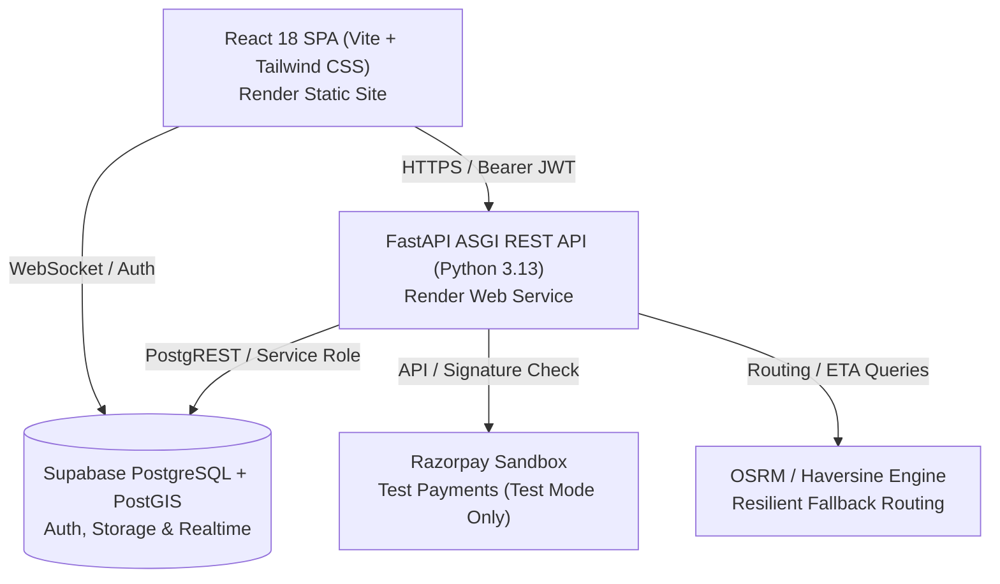

# On-Demand Vehicle Service Platform

An end-to-end doorstep vehicle care and maintenance platform connecting vehicle owners with vetted roadside mechanics for on-demand servicing, inspections, and emergency assistance.

> **Project Purpose:** This application is developed for **academic demonstration, college project evaluation, and portfolio showcase**. It demonstrates modern full-stack web architecture, real-time geolocation tracking, role-based access control, cryptographic verification, and state-machine business workflows.

---

## Architecture Overview



### Technology Stack
- **Frontend:** React 18, TypeScript, Vite, Tailwind CSS, TanStack React Query, React Router v6, Lucide Icons, Leaflet.
- **Backend:** FastAPI, Python 3.13, Uvicorn, Pydantic Settings v2, Structlog, PyJWT, HTTPX.
- **Database & Auth:** Supabase (PostgreSQL with PostGIS, Row Level Security, Supabase Auth, Storage buckets).
- **Payment Gateway:** Razorpay (Test/Sandbox mode only with strict zero-real-money safety guards).
- **Routing Engine:** Open Source Routing Machine (OSRM) with automatic geometric fallback.

---

## Repository Structure

```
├── backend/                  # FastAPI Python backend service
│   ├── app/
│   │   ├── api/              # API route controllers (v1)
│   │   ├── commands/         # Management and background job commands
│   │   ├── core/             # Configuration, logging, rate limiting, safety guards
│   │   ├── db/               # Supabase connection & RBAC dependencies
│   │   ├── schemas/          # Pydantic v2 validation models
│   │   ├── services/         # Authoritative business logic & state machines
│   │   └── main.py           # FastAPI application entry point
│   ├── tests/                # Pytest automated test suite (470+ tests)
│   ├── Dockerfile            # Container configuration (optional)
│   ├── requirements.txt      # Python dependencies
│   └── .env.example          # Backend environment template
├── frontend/                 # React + TypeScript single-page application
│   ├── src/
│   │   ├── components/       # Reusable UI components
│   │   ├── context/          # React contexts (Auth)
│   │   ├── hooks/            # Custom hooks
│   │   ├── lib/              # Supabase & API client singletons
│   │   ├── pages/            # Application views (Customer, Mechanic, Admin)
│   │   ├── types/            # TypeScript definitions
│   │   └── main.tsx          # React application entry point
│   ├── package.json          # Node dependencies & build scripts
│   └── .env.example          # Frontend environment template
├── supabase/
│   └── migrations/           # 22 versioned SQL migration scripts
└── docker-compose.yml        # Local orchestration (optional)
```

---

## Student Deployment

This section details how to deploy this project for free/low-cost demonstration using **GitHub**, **Render**, **Supabase**, and **Razorpay Sandbox**.

> [!NOTE]
> **Educational & Portfolio Notice:**
> This deployment configuration is designed specifically for college/demo/portfolio use. It avoids unnecessary enterprise infrastructure (such as dedicated VPS clusters, Kubernetes, Terraform, or self-hosted OSRM servers). Real-money payouts are hard-locked off (`LIVE_PAYOUTS_ENABLED=false`).

### Deployment Architecture

```
GitHub Repository
       ↓
Render Static Site (Frontend SPA)
       ↓
Render Web Service (FastAPI Backend)
       ↓
Supabase (Database, Auth, Storage)
       ↓
Razorpay Sandbox (Test Payments)
```

---

### 1. Local Setup

Before deploying, you can run and test both frontend and backend locally:

#### Backend Setup
```bash
cd backend
python -m venv .venv
# On Windows:
.\.venv\Scripts\activate
# On Linux/macOS:
# source .venv/bin/activate

pip install -r requirements.txt
cp .env.example .env
# Edit .env with your Supabase credentials
uvicorn app.main:app --reload --host 0.0.0.0 --port 8000
```

#### Frontend Setup
```bash
cd frontend
npm install
cp .env.example .env
# Edit .env with your Supabase credentials and API URL
npm run dev
```

---

### 2. Environment Variables Reference

#### Backend Variables (`backend/.env`)

| Variable | Required | Default / Example | Purpose |
| :--- | :--- | :--- | :--- |
| `ENVIRONMENT` | Yes | `staging` or `development` | Set `staging` on Render for student demo to allow both local & hosted testing |
| `DEBUG` | No | `false` | Disable in deployed environments |
| `CORS_ORIGINS` | Yes | `http://localhost:5173,https://<your-frontend>.onrender.com` | Allowed browser origins |
| `SUPABASE_URL` | Yes | `https://<ref>.supabase.co` | Supabase project API URL |
| `SUPABASE_PUBLISHABLE_KEY` | Yes | `sb_publishable_...` | Supabase public key |
| `SUPABASE_SERVICE_ROLE_KEY` | Yes | `eyJ...` | **Backend secret only** (never expose to frontend) |
| `SUPABASE_JWT_SECRET` | Yes | `32+ characters` | Supabase JWT secret |
| `RAZORPAY_KEY_ID` | Optional | `rzp_test_...` | Razorpay test key ID |
| `RAZORPAY_KEY_SECRET` | Optional | `...` | Razorpay test secret key |
| `LIVE_PAYOUTS_ENABLED` | Yes | `false` | **Always false** (safety barrier preventing live payouts) |
| `PAYOUT_PROVIDER_MODE` | Yes | `sandbox` | Safe mock payout execution |

#### Frontend Variables (`frontend/.env`)

| Variable | Required | Example | Purpose |
| :--- | :--- | :--- | :--- |
| `VITE_API_BASE_URL` | Yes | `https://<your-backend>.onrender.com/api/v1` | URL pointing to your deployed Render backend |
| `VITE_SUPABASE_URL` | Yes | `https://<ref>.supabase.co` | Supabase project API URL |
| `VITE_SUPABASE_PUBLISHABLE_KEY` | Yes | `sb_publishable_...` | Supabase public anon key |

---

### 3. GitHub Preparation

1. Push your clean code to your personal GitHub repository:
   ```bash
   git add .
   git commit -m "Prepare vehicle service platform for Render deployment"
   git branch -M main
   git remote add origin https://github.com/<your-username>/<your-repo-name>.git
   git push -u origin main
   ```
2. Verify that **no `.env` files** are pushed (they are ignored by `.gitignore`).

---

### 4. Render Backend Deployment (Web Service)

1. Sign in to [Render](https://render.com) and click **New +** → **Web Service**.
2. Connect your GitHub repository.
3. Configure the service settings:
   - **Name:** `vehicle-service-backend`
   - **Environment:** `Python 3`
   - **Region:** Choose the region nearest to you (e.g., Oregon, Frankfurt, Singapore)
   - **Branch:** `main`
   - **Root Directory:** `backend`
   - **Build Command:** `pip install -r requirements.txt`
   - **Start Command:** `uvicorn app.main:app --host 0.0.0.0 --port $PORT`
   - **Instance Type:** `Free`
4. Add the following **Environment Variables** in the Render dashboard:
   - `ENVIRONMENT` = `staging`
   - `DEBUG` = `false`
   - `SUPABASE_URL` = `<your-supabase-url>`
   - `SUPABASE_PUBLISHABLE_KEY` = `<your-supabase-publishable-key>`
   - `SUPABASE_SERVICE_ROLE_KEY` = `<your-supabase-service-role-key>`
   - `SUPABASE_JWT_SECRET` = `<your-supabase-jwt-secret>`
   - `LIVE_PAYOUTS_ENABLED` = `false`
   - `PAYOUT_PROVIDER_MODE` = `sandbox`
   - `CORS_ORIGINS` = `http://localhost:5173` *(update with your frontend URL in Step 6)*
   - `RAZORPAY_KEY_ID` = *(optional test key)*
   - `RAZORPAY_KEY_SECRET` = *(optional test secret)*
5. Click **Create Web Service**. Wait for the build and deployment to complete.
6. Note your backend URL (e.g., `https://vehicle-service-backend.onrender.com`).
   Verify health: visit `https://vehicle-service-backend.onrender.com/health` in your browser (should return `{"status":"ok"}`).

---

### 5. Render Frontend Deployment (Static Site)

1. In Render, click **New +** → **Static Site**.
2. Connect the same GitHub repository.
3. Configure the static site settings:
   - **Name:** `vehicle-service-frontend`
   - **Branch:** `main`
   - **Root Directory:** `frontend`
   - **Build Command:** `npm install && npm run build`
   - **Publish Directory:** `dist`
4. Add the following **Environment Variables**:
   - `VITE_API_BASE_URL` = `https://vehicle-service-backend.onrender.com/api/v1`
   - `VITE_SUPABASE_URL` = `<your-supabase-url>`
   - `VITE_SUPABASE_PUBLISHABLE_KEY` = `<your-supabase-publishable-key>`
5. Click **Create Static Site**. Wait for Vite to build and deploy.
6. Note your frontend URL (e.g., `https://vehicle-service-frontend.onrender.com`).

---

### 6. CORS Configuration Update

Once your frontend static site URL is generated:
1. Return to your **Backend Web Service** in Render.
2. Go to **Environment** tab.
3. Update `CORS_ORIGINS` to include your live frontend URL and local dev URL:
   ```
   CORS_ORIGINS=http://localhost:5173,https://vehicle-service-frontend.onrender.com
   ```
4. Render will automatically redeploy the backend with the new allowed origin.

---

### 7. SPA Rewrite Rule (React Router Support)

Because this frontend is a Single Page Application (SPA) using React Router, any deep link or page reload (e.g., `/login`, `/dashboard`) must be routed to `index.html`:

1. In Render, open your **Frontend Static Site**.
2. Navigate to **Redirects / Rewrites**.
3. Add a new rule:
   - **Source:** `/*`
   - **Destination:** `/index.html`
   - **Action:** `Rewrite`
4. Save the rule.

---

### 8. Supabase & Razorpay Configuration

- **Supabase:**
  - Execute database migrations from `supabase/migrations/` in your Supabase SQL Editor if setting up a fresh project.
  - In **Authentication** → **URL Configuration**, add your Render frontend URL (`https://vehicle-service-frontend.onrender.com`) to **Site URL** and **Redirect URLs**.
- **Razorpay Sandbox:**
  - Create a Razorpay test account at [dashboard.razorpay.com](https://dashboard.razorpay.com).
  - Use test API credentials (`rzp_test_...`).
  - No real money is ever moved.

---

### 9. Testing & Post-Deployment Verification

1. **Backend Health Probe:**
   Open `https://<your-backend>.onrender.com/health` → verify status is `"ok"`.
2. **Interactive API Documentation:**
   Open `https://<your-backend>.onrender.com/docs` to test Swagger endpoints.
3. **Frontend Application:**
   Open `https://<your-frontend>.onrender.com`.
   - Test user registration and login.
   - Test booking flow and roadside assistance dispatch.
   - Verify network requests in browser DevTools point to your Render backend API.

---

## Running Automated Tests

```bash
# Run backend test suite (470+ tests)
cd backend
pytest

# Run frontend test suite (120+ tests)
cd frontend
npm test

# Verify production build
npm run build
```
