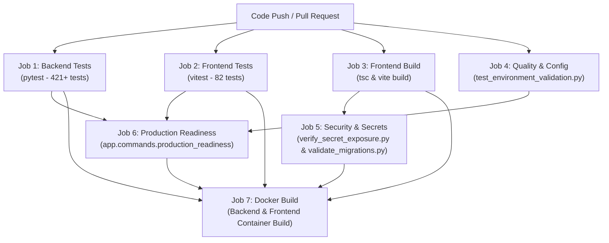

# CI/CD Pipeline Architecture & Automation (Phase 10)

This document specifies the automated Continuous Integration and Continuous Deployment (CI/CD) pipelines powering the Vehicle Service Platform via GitHub Actions.

---

## 1. Pipeline Overview & Seven Core Jobs

Every push and pull request against `main`, `master`, `staging`, and `develop` triggers `.github/workflows/ci.yml`, orchestrating seven specialized jobs with fail-fast semantics:



---

## 2. Job Specifications

### Job 1: Backend Unit & Integration Tests (`backend-tests`)
- **Runtime**: Ubuntu latest, Python 3.13.
- **Commands**:
  ```bash
  pip install -r requirements.txt
  pytest -v --tb=short
  ```
- **Coverage**: All 421+ unit, integration, and security tests across addresses, auth, bookings, chat, config, evidence, mechanics, payouts, settlements, and admin operations.
- **Safety**: Runs with `ENVIRONMENT=test`, `LIVE_PAYOUTS_ENABLED=false`, and mock credentials.

### Job 2: Frontend Unit & Component Tests (`frontend-tests`)
- **Runtime**: Ubuntu latest, Node.js 20.
- **Commands**:
  ```bash
  npm ci
  npm test -- --run
  ```
- **Coverage**: All 82 Vitest tests across dashboard, payouts, settlements, tracking, chat, and reviews.

### Job 3: Frontend Production Build & Bundle Generation (`frontend-build`)
- **Runtime**: Ubuntu latest, Node.js 20.
- **Commands**:
  ```bash
  npm ci
  npm run build
  ```
- **Artifact**: Produces production bundle in `frontend/dist/` and uploads as a GitHub Actions artifact for subsequent security inspection.

### Job 4: Backend Quality & Configuration Checks (`quality-and-config`)
- **Runtime**: Ubuntu latest, Python 3.13.
- **Commands**:
  ```bash
  pytest tests/test_environment_validation.py -v
  ```
- **Verification**: Validates all configuration permutations for `development`, `test`, `staging`, and `production`. Asserts that `LIVE_PAYOUTS_ENABLED=true` is rejected in non-production environments.

### Job 5: Security Audit & Secret Exposure Verification (`security-and-secrets`)
- **Dependencies**: Depends on `frontend-build`.
- **Commands**:
  ```bash
  python scripts/verify_secret_exposure.py
  python scripts/validate_migrations.py
  ```
- **Verification**:
  - Scans `frontend/dist/` bundle for leakage of service role keys, Razorpay secrets, private keys, or database URLs.
  - Scans `.gitignore` for proper exclusion of `.env`.
  - Audits all 19 Supabase migrations for chronological ordering, non-destructive safety, and explicit RLS.

### Job 6: Production Readiness Evaluation (`production-readiness`)
- **Dependencies**: Depends on `backend-tests`, `frontend-tests`, `quality-and-config`.
- **Command**:
  ```bash
  python -m app.commands.production_readiness
  ```
- **Verification**: Executes the platform readiness evaluator against staging configuration parameters, asserting database connectivity, schema tables, CORS security, and real-money payout blocking.

### Job 7: Container Build Verification (`docker-build`)
- **Dependencies**: Runs only after all prior 6 jobs succeed.
- **Action**: Uses `docker/build-push-action@v5` to test build the backend and frontend Dockerfiles without pushing to a registry.

---

## 3. Deployment Workflows

### Staging Deployment (`.github/workflows/deploy-staging.yml`)
- Triggered automatically on push to `staging` branch or manual dispatch.
- Enforces financial safety checks (`LIVE_PAYOUTS_ENABLED=false`).
- Deploys backend container and frontend static assets to staging infrastructure.
- Runs post-deployment smoke test suite (`pytest tests/test_deployment_smoke.py`).

### Production Deployment (`.github/workflows/deploy-production.yml`)
- Triggered exclusively on GitHub Release publication or protected manual dispatch.
- Requires explicit user input `confirm_live_payouts_blocked: CONFIRM_PAYOUTS_DISABLED`.
- Runs production readiness CLI prior to executing container rollouts.
- Zero-downtime rolling update with post-deployment health probes.

---

## 4. Financial Safety Rules in CI/CD

> [!CAUTION]
> **Hard Invariants Enforced in Pipelines**:
> 1. `LIVE_PAYOUTS_ENABLED` is hardcoded to `"false"` in all automated CI jobs.
> 2. No live Razorpay / RazorpayX keys are stored in GitHub Actions repository secrets for CI testing.
> 3. Production deployment requires separate, explicit authorization before real payouts could ever be enabled.
