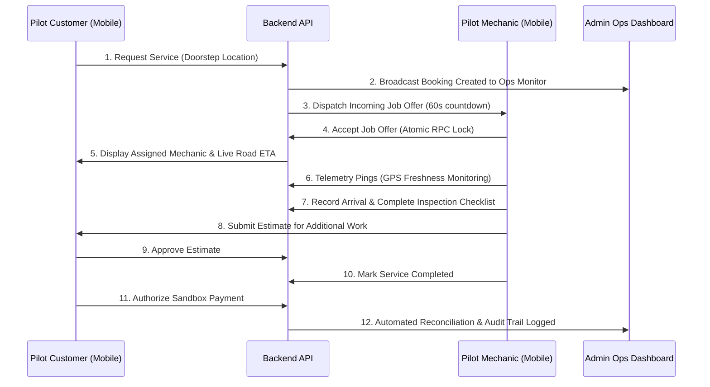

# Controlled Production Pilot Plan & Operational Protocol

## Overview

Prior to general public release, the **VehicleCare** platform operates under a strictly governed **Controlled Production Pilot**. The pilot tests real-world physical dispatch, live mobile telemetry across varying cellular network conditions, and end-to-end customer satisfaction while enforcing absolute financial safety.

---

## 1. Pilot Scope & Constraints

| Parameter | Pilot Specification |
| :--- | :--- |
| **Participant Cohort** | **12 Trusted Customers** (internal employees & trusted beta testers) |
| **Mechanic Cohort** | **5 Vetted Mechanics** equipped with Android/iOS mobile devices |
| **Geographic Boundary** | **Bangalore Central & East** (Koramangala, Indiranagar, MG Road, Domlur) |
| **Operating Hours** | **09:00 IST – 18:00 IST** (Monday through Saturday) |
| **Service Categories** | Periodic Maintenance, Battery Jumpstart, Brake Inspection, Diagnostic Check |
| **Payment Mode** | **Razorpay Sandbox / Test Mode Only** (Zero real customer money charged) |
| **Payout Mode** | **LIVE_PAYOUTS_ENABLED = false** (Hard-coded safety lock; no real money moved) |
| **Pilot Duration** | **14 Calendar Days** |

---

## 2. Pilot Operational Workflow

---

## 3. Measurable Pilot Success Criteria

### A. Technical Criteria:
- **Zero Critical Outages**: 100% platform availability during pilot operating hours.
- **Zero Double Assignments**: Competing mechanic acceptance rate handled deterministically with zero double assignments.
- **Zero Financial Discrepancies**: Reconciliation engine confirms 100% parity between bookings, sandbox payment records, and ledger credits.
- **Zero RLS Violations**: Zero cross-user or cross-role data leaks.

### B. Operational Criteria:
- **Matching Dispatch Time**: Median offer dispatch < 5 seconds from customer request.
- **ETA Accuracy**: Predicted road ETA within $\pm 4$ minutes of physical arrival.
- **GPS Reliability**: $\ge 95\%$ of mechanic telemetry pings classified as `LIVE` or `RECENT`.
- **Estimate Approval Rate**: Clear mobile UX enabling customer estimate approval in < 60 seconds.

---

## 4. Immediate Pilot Pause Triggers (Failure Criteria)

The pilot must be **immediately halted** if any of the following occur:
1. **Critical Security or RLS Breach**: Any customer or mechanic able to view another user's private records.
2. **Double Booking or Double Assignment**: Two mechanics assigned to the same booking ID.
3. **Financial Ledger Corruption**: Any duplicate transaction ID or ledger calculation discrepancy.
4. **Attempted Live Money Movement**: Any transaction attempted without sandbox mode active.
5. **Continuous Telemetry Teleportation**: Unhandled GPS spoofing corrupting matching dispatch.
6. **Backend Process Crash Loop**: Uncaught exceptions causing background job runner failure.

---

## 5. Escalation Contacts & Rollback Protocol

- **Incident Commander (SRE)**: Lead Reliability Engineer (P1 on-call)
- **Security Lead**: Platform Security Architect
- **Operations Lead**: Bangalore Dispatch Operations Manager
- **Rollback Protocol**: Documented in [`docs/DEPLOYMENT_CERTIFICATION.md`](file:///c:/Users/kmvis/OneDrive/Documents/vehicle-service-platform/docs/DEPLOYMENT_CERTIFICATION.md) (revert CDN hash, roll back backend container image, maintain backward-compatible database schema).
