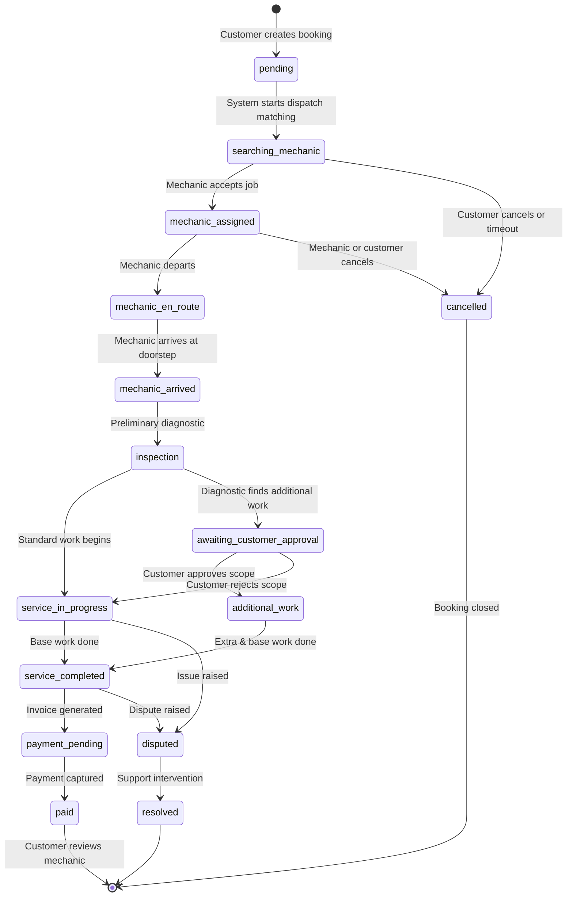

# Database Architecture & Specification

## Platform Overview
**Project**: On-Demand Bike & Car Doorstep Service Platform  
**Target Environment**: Supabase (PostgreSQL 17)  
**Database Host**: `db.dfigtryvvujhwuiyzdvs.supabase.co` (`ap-southeast-1`)  
**Extensions**: `uuid-ossp`, `pgcrypto`, `postgis`  

The platform connects vehicle owners (customers) with certified local mechanics for on-demand doorstep servicing, vehicle inspection, emergency roadside support, and scheduled maintenance.

---

## 1. Architectural Highlights & Engineering Standards
1. **Identity & Authentication**:
   - `auth.users` serves as the single source of truth for user authentication.
   - Application profiles link to `auth.users(id)` with `ON DELETE CASCADE`.
   - No sensitive authentication data (passwords, salts, provider tokens) is ever stored in application tables.
   - An event-driven trigger (`handle_new_user`) automatically provisions `profiles` and role-specific profile extensions (`customer_profiles` or `mechanic_profiles`) upon user signup.
2. **Keying & Timestamps**:
   - Primary keys use native PostgreSQL UUIDs (`gen_random_uuid()`).
   - All timestamps utilize `timestamptz` with `clock_timestamp()` default.
   - `updated_at` timestamps are updated automatically via database trigger (`handle_updated_at`).
3. **Monetary Precision**:
   - Financial values (e.g., prices, totals, tax, discounts, fees) use `NUMERIC(10, 2)` to eliminate floating-point rounding inaccuracies.
4. **Geospatial & Proximity Dispatch**:
   - PostGIS 3.3.7 is enabled.
   - Coordinates (`latitude` and `longitude`) are stored with decimal precision `NUMERIC(10, 7)` and validated with range check constraints (`-90 <= lat <= 90`, `-180 <= lng <= 180`).
   - High-performance GiST spatial indexes are defined across `mechanic_profiles`, `addresses`, `bookings`, and `mechanic_locations` using `extensions.ST_SetSRID(extensions.ST_MakePoint(lng, lat), 4326)::geography`.
   - The platform includes a specialized PostGIS search function `public.find_nearby_mechanics(cust_lat, cust_lng, max_distance_km)`.
5. **Zero Trust & Row Level Security (RLS)**:
   - RLS is enabled on 100% of application tables (33/33).
   - 83 granular security policies enforce role separation between Customers, Mechanics, Support, and Admin.
   - Security Definer helper functions (`is_admin()`, `is_admin_or_support()`, `get_mechanic_id_for_user()`) prevent policy recursion and execute with strict schema search paths.
6. **Auditability & State Integrity**:
   - The booking lifecycle transitions through an append-only audit trail (`booking_status_history`) managed by an automatic database trigger (`trg_track_booking_status`).
   - Administrative and critical entity modifications are logged in `audit_logs`.

---

## 2. Entity Descriptions & Schemas

### A. Identity & Profiles
1. **`profiles`**: Central profile table directly referencing `auth.users(id)`.
   - Fields: `id` (UUID PK), `full_name`, `phone`, `email`, `avatar_url`, `role` (`customer`, `mechanic`, `admin`, `support`), `is_active`, `created_at`, `updated_at`.
2. **`customer_profiles`**: Extended profile for vehicle owners.
   - Fields: `id` (UUID PK), `user_id` (UUID UNIQUE FK -> `profiles.id`), `emergency_contact_name`, `emergency_contact_phone`, `created_at`, `updated_at`.
3. **`mechanic_profiles`**: Operational metadata for mechanics.
   - Fields: `id` (UUID PK), `user_id` (UUID UNIQUE FK -> `profiles.id`), `business_name`, `experience_years`, `bio`, `verification_status` (`pending`, `under_review`, `verified`, `rejected`, `suspended`), `is_available`, `service_radius_km`, `current_latitude`, `current_longitude`, `current_location_updated_at`, `average_rating`, `total_completed_jobs`, `created_at`, `updated_at`.
   - *Synchronization Strategy*: `average_rating` is recalculated via trigger `trg_sync_mechanic_review_stats` whenever a review is posted or modified. `total_completed_jobs` is incremented atomically via `trg_sync_mechanic_completed_jobs` upon booking completion.
4. **`mechanic_documents`**: Verification documents submitted by mechanics.
   - Fields: `id` (UUID PK), `mechanic_id` (FK -> `mechanic_profiles.id`), `document_type` (`identity`, `driving_license`, `mechanic_certificate`, `address_proof`, `other`), `document_number`, `file_path`, `verification_status` (`pending`, `under_review`, `verified`, `rejected`), `rejection_reason`, `verified_by` (FK -> `profiles.id`), `verified_at`, `created_at`, `updated_at`.

### B. Vehicle Registry & Customer Addresses
5. **`vehicle_types`**: Vehicle classifications (`bike`, `car`).
6. **`vehicle_brands`**: Manufacturer brands (e.g., Honda, Maruti Suzuki, Hyundai, Yamaha).
7. **`vehicle_models`**: Models mapped to brands and vehicle types with optional production years. Unique constraint on `(brand_id, vehicle_type_id, name)`.
8. **`vehicles`**: Customer registered vehicles.
   - Fields: `id` (UUID PK), `customer_id` (FK -> `profiles.id`), `vehicle_type_id`, `brand_id`, `model_id`, `registration_number`, `nickname`, `manufacture_year`, `color`, `fuel_type`, `odometer_km`, `is_primary`, `created_at`, `updated_at`.
   - Constraints: `UNIQUE(customer_id, registration_number)`.
9. **`addresses`**: Saved customer service locations.
   - Fields: `id` (UUID PK), `customer_id` (FK -> `profiles.id`), `label`, `address_line`, `area`, `city`, `state`, `postal_code`, `latitude`, `longitude`, `landmark`, `is_default`, `created_at`, `updated_at`.

### C. Service Catalog & Dynamic Pricing
10. **`service_categories`**: Service taxonomy (e.g., periodic service, emergency roadside, repairs, battery, tyres, washing).
11. **`services`**: Service packages.
    - Fields: `id` (UUID PK), `category_id` (FK -> `service_categories.id`), `name`, `description`, `vehicle_type` (`bike`, `car`, `both`), `estimated_duration_minutes`, `is_emergency`, `is_active`, `created_at`, `updated_at`.
12. **`service_pricing`**: Dynamic pricing matrix.
    - Fields: `id` (UUID PK), `service_id` (FK -> `services.id`), `vehicle_type_id` (FK -> `vehicle_types.id`), `base_price`, `minimum_price`, `pricing_parameters` (JSONB), `effective_from`, `effective_to`, `is_active`, `created_at`, `updated_at`.

### D. Booking Lifecycle & Dispatch
13. **`bookings`**: The central transactional record for doorstep service.
    - Fields: `id` (UUID PK), `booking_number` (UNIQUE), `customer_id`, `vehicle_id`, `address_id`, `scheduled_at`, `requested_latitude`, `requested_longitude`, `customer_notes`, `subtotal`, `additional_charges`, `discount_amount`, `tax_amount`, `total_amount`, `payment_status`, `booking_status`, `created_at`, `updated_at`.
14. **`booking_items`**: Line items of requested services within a booking.
15. **`booking_status_history`**: Audit trail of every booking transition.
    - Fields: `id`, `booking_id`, `old_status`, `new_status`, `changed_by`, `reason`, `metadata`, `created_at`.
    - Maintained by trigger `trg_track_booking_status`.
16. **`mechanic_assignments`**: Job dispatch and bidding/acceptance record.
    - Fields: `id` (UUID PK), `booking_id`, `mechanic_id`, `assignment_status` (`offered`, `accepted`, `rejected`, `expired`, `cancelled`, `completed`), `distance_km`, `estimated_arrival_minutes`, `offered_at`, `responded_at`, `assigned_at`, `rejected_reason`.
17. **`mechanic_locations`**: High-frequency telemetry for active mechanics en route.
    - Fields: `id` (UUID PK), `mechanic_id`, `latitude`, `longitude`, `accuracy_meters`, `recorded_at`.
    - Covered by composite index `(mechanic_id, recorded_at DESC)` and PostGIS GiST index.

### E. Inspections & Additional Work Approval
18. **`service_inspections`**: Mechanic digital diagnostic findings.
    - Fields: `id` (UUID PK), `booking_id`, `mechanic_id`, `findings`, `vehicle_condition`, `estimated_additional_cost`.
19. **`additional_work_requests`**: Scope change governance.
    - Fields: `id` (UUID PK), `booking_id`, `mechanic_id`, `title`, `description`, `price`, `evidence_file_paths` (TEXT[]), `status` (`pending`, `approved`, `rejected`, `cancelled`, `completed`), `customer_response`, `responded_at`.
    - *Rule*: Additional charges become billable only after customer updates status to `approved`.

### F. Payments, Billing & Customer Feedback
20. **`payments`**: Payment records.
    - Fields: `id` (UUID PK), `booking_id`, `customer_id`, `amount`, `currency`, `status` (`pending`, `authorized`, `captured`, `failed`, `refunded`), `payment_method`, `provider`, `provider_payment_id`, `paid_at`.
21. **`payment_transactions`**: Gateway attempt logs and webhook responses.
    - Fields: `id` (UUID PK), `payment_id`, `provider_transaction_id`, `amount`, `status`, `raw_provider_response` (JSONB), `failure_reason`.
22. **`invoices`**: Official generated billing document.
    - Fields: `id` (UUID PK), `invoice_number` (UNIQUE), `booking_id` (UNIQUE), `customer_id`, `subtotal`, `tax`, `discount`, `total`, `issued_at`, `status`.
23. **`service_reports`**: Mechanic completion summary and vehicle health certificate.
    - Fields: `id` (UUID PK), `booking_id` (UNIQUE), `mechanic_id`, `summary`, `work_performed`, `recommendations`, `customer_notes`, `report_file_path`.
24. **`reviews`**: Ratings and feedback.
    - Fields: `id` (UUID PK), `booking_id` (UNIQUE), `customer_id`, `mechanic_id`, `rating` (1-5), `review_text`.
    - Trigger `trg_sync_mechanic_review_stats` automatically recalculates `mechanic_profiles.average_rating`.
25. **`coupons`**: Promotional discount rules.
26. **`coupon_usage`**: Redemption ledger per customer/booking.

### G. Communication, Support, Reminders & Audit
27. **`notifications`**: In-app notifications with delivery and read tracking.
28. **`chat_rooms`**: Booking-scoped communication channel between customer and assigned mechanic. Automatically initialized by trigger `trg_create_chat_room_on_assignment` when an assignment is accepted.
29. **`chat_messages`**: Chat messages with support for text, images, location coordinates, and attachments.
30. **`support_tickets`**: Customer support issues.
31. **`support_messages`**: Messages exchanged inside support tickets.
32. **`maintenance_reminders`**: Predictive vehicle servicing schedules by calendar date or odometer reading.
33. **`audit_logs`**: System security and administration ledger tracking entity mutations (`old_data`, `new_data`, `actor_id`, `ip_address`, `user_agent`).

---

## 3. Booking State Machine

---

## 4. Payment State Concepts

| State | Description | Next Permitted States |
| :--- | :--- | :--- |
| **`pending`** | Order initiated; payment intent created at gateway | `authorized`, `captured`, `failed` |
| **`authorized`** | Amount blocked on customer card/account | `captured`, `failed`, `refunded` |
| **`captured`** | Funds successfully collected | `refunded` |
| **`failed`** | Transaction declined or timed out | `pending` (retry) |
| **`refunded`** | Partial or full refund issued through gateway | Final state |

---

## 5. Row Level Security (RLS) Strategy

| Role | Access Permissions Summary |
| :--- | :--- |
| **Customer** | Full access to own profile, customer vehicles, addresses, reminders, notifications, and support tickets. Can create bookings and view line items, invoices, and service reports for bookings they own. Can submit reviews on completed bookings. Read/write access to chat messages for active bookings. |
| **Mechanic** | Can manage own mechanic profile, upload compliance documents, and update availability and GPS coordinates. Can view offered bookings and full details of accepted bookings. Can submit inspection reports, additional work requests, and service reports. Can participate in chat for assigned bookings. Cannot view other mechanics' documents. |
| **Admin / Support** | Elevated global read across all tables via `is_admin_or_support()`. Admin-only write access to service definitions, pricing matrices, coupons, document verification, and system audit logs via `is_admin()`. |

---

## 6. Storage Buckets & Policies

| Bucket Name | Access | Max File Size | Permitted MIME Types | Purpose |
| :--- | :--- | :--- | :--- | :--- |
| **`avatars`** | Public Read, Auth User Write | 5 MB | JPEG, PNG, WEBP | Profile avatars |
| **`mechanic-documents`** | Private (Mechanic + Admin) | 10 MB | JPEG, PNG, WEBP, PDF | ID cards, licenses, certifications |
| **`service-evidence`** | Private (Booking Parties + Admin) | 15 MB | JPEG, PNG, WEBP, MP4 | Pre-service damage photos, part wear videos |
| **`service-reports`** | Private (Customer + Mechanic + Admin)| 10 MB | PDF, JPEG, PNG | Digital service checklists and completion reports |
| **`chat-attachments`** | Private (Room Participants + Admin) | 10 MB | JPEG, PNG, WEBP, PDF | In-chat media and roadside photos |

---

## 7. Supabase Realtime Publication
The `supabase_realtime` publication broadcasts CDC events for:
- `public.bookings`: Real-time booking status changes.
- `public.mechanic_locations`: Live mechanic GPS coordinates during transit.
- `public.chat_messages`: Instant in-app messaging.
- `public.notifications`: Push alerts for assignment, arrival, and billing.
- `public.additional_work_requests`: Live popups for customer approval on extra work.
