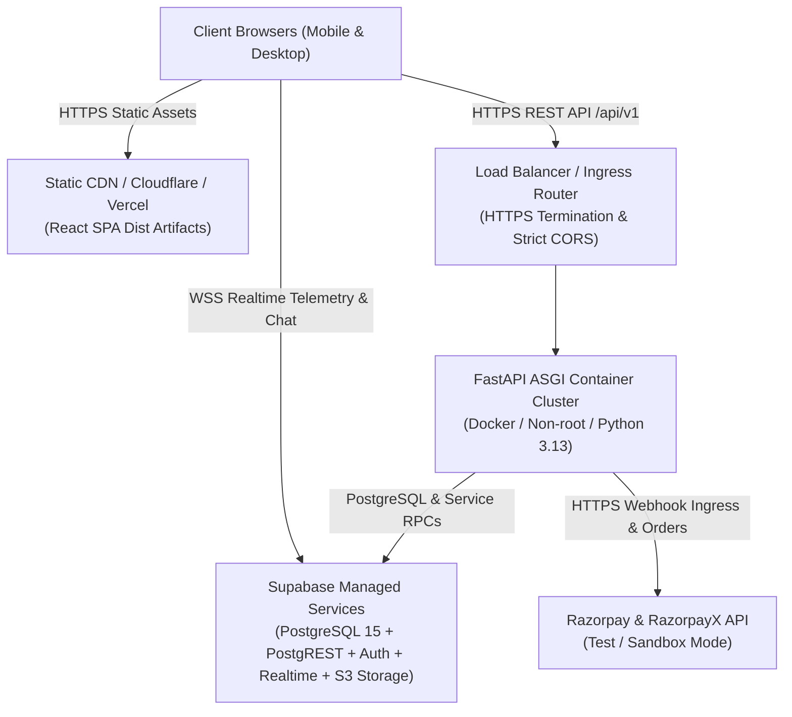

# Production Deployment Guide (Phase 10)

This document provides step-by-step instructions for deploying the Vehicle Service Platform using a practical, reliable, container-based and static CDN deployment architecture.

---

## 1. Production Architecture Overview



### Component Distribution
1. **Frontend**: Static React single-page application compiled into `dist/` and distributed via edge CDN (Cloudflare Pages, Vercel, or AWS CloudFront).
2. **Backend**: Containerized FastAPI service running on a container-capable runtime (Docker, Render, Railway, AWS ECS, or Fly.io) with 2+ worker processes.
3. **Database & Storage**: Managed Supabase PostgreSQL project (`dfigtryvvujhwuiyzdvs`) with 41 core tables and explicit Row Level Security (RLS).
4. **Payments & Payouts**: Razorpay payment gateway and RazorpayX payout integration (enforced in sandbox/test mode).

---

## 2. Pre-Deployment Verification Checklist

Before initiating any deployment to staging or production, execute the automated verification pipeline:

```bash
# 1. Backend test suite verification (421+ tests)
cd backend
.venv/Scripts/python -m pytest

# 2. Frontend test suite verification (82 tests)
cd ../frontend
npm test -- --run

# 3. Frontend production compilation & typecheck
npm run build

# 4. Secret exposure & client artifact scanner
cd ..
python scripts/verify_secret_exposure.py

# 5. Database migration safety audit
python scripts/validate_migrations.py

# 6. Production readiness CLI evaluation
cd backend
python -m app.commands.production_readiness
```

All 6 commands must exit with code 0 before proceeding.

---

## 3. Container Deployment (Backend)

### 3.1. Build Production Image
```bash
docker build -t vehicle-service-backend:latest ./backend
```

### 3.2. Run Container with Production Configuration
```bash
docker run -d \
  --name vehicle-service-backend \
  -p 8000:8000 \
  --restart unless-stopped \
  -e ENVIRONMENT=production \
  -e DEBUG=false \
  -e SUPABASE_URL="https://dfigtryvvujhwuiyzdvs.supabase.co" \
  -e SUPABASE_PUBLISHABLE_KEY="<PROD_PUBLISHABLE_KEY>" \
  -e SUPABASE_SERVICE_ROLE_KEY="<PROD_SERVICE_ROLE_KEY>" \
  -e SUPABASE_JWT_SECRET="<PROD_JWT_SECRET_MIN_32_CHARS>" \
  -e CORS_ORIGINS='["https://app.vehiclecare.com","https://admin.vehiclecare.com"]' \
  -e RAZORPAY_KEY_ID="<RAZORPAY_KEY_ID>" \
  -e RAZORPAY_KEY_SECRET="<RAZORPAY_KEY_SECRET>" \
  -e RAZORPAY_WEBHOOK_SECRET="<RAZORPAY_WEBHOOK_SECRET>" \
  -e LIVE_PAYOUTS_ENABLED=false \
  -e PAYOUT_PROVIDER_MODE=sandbox \
  vehicle-service-backend:latest
```

### 3.3. Verify Container Health
```bash
# Probe liveness (must return HTTP 200 with status: ok)
curl -i http://localhost:8000/health/live

# Probe readiness (must return HTTP 200 with all subsystems connected)
curl -i http://localhost:8000/health/ready
```

---

## 4. Frontend CDN Deployment

1. Build static production bundle:
   ```bash
   cd frontend
   npm ci
   npm run build
   ```
2. Verify contents of `dist/`:
   - `index.html` (entry point with cache-busting asset references)
   - `assets/*.js` (content-hashed chunks)
   - `assets/*.css` (tailored styling bundle)
3. Deploy `dist/` directory to static hosting provider (e.g. Cloudflare Pages, AWS S3 bucket, or Nginx server).
4. Configure cache headers:
   - `assets/*`: `Cache-Control: public, max-age=31536000, immutable`
   - `index.html`: `Cache-Control: no-cache, no-store, must-revalidate`

---

## 5. Post-Deployment Smoke Verification

Execute the automated post-deployment smoke test suite:
```bash
cd backend
python -m pytest tests/test_deployment_smoke.py -v
```

This verifies:
- Liveness and readiness endpoints
- Database connectivity
- Authentication rejection and token validation
- Customer vehicle catalog
- Mechanic dashboard accessibility
- Real-money payout blocking guard
- Admin operations and reconciliation scanners
