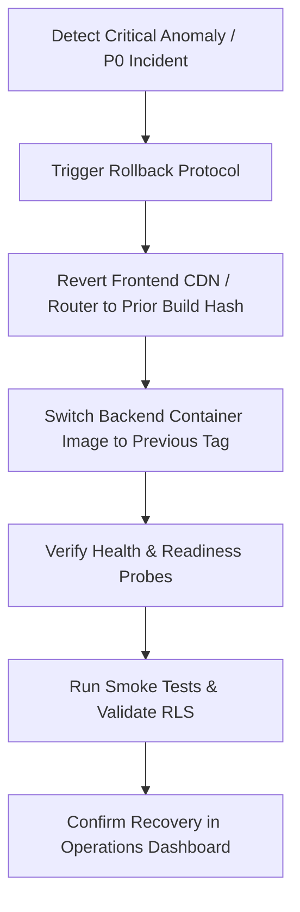

# Deployment Certification & Release Rollback Specification

## Overview

This document specifies the deployment readiness criteria, containerized infrastructure, environment configurations, and rollback procedures for the **VehicleCare** platform.

---

## 1. Build & Artifact Verification

### Frontend Production Artifacts:
- **Build Tool**: Vite 5.2 + TypeScript 5.4 (`npm run build`).
- **Compilation Status**: Zero TypeScript type errors, zero bundling errors.
- **Output Artifacts**: Validated in `frontend/dist/`.
- **Assets Hashing**: Content-hash-based cache busting enabled (`index-Co-qwx28.js`, `index-DTp0NVYl.css`).

### Backend Container Configuration:
- **Runtime**: Python 3.13 / FastAPI ASGI (Uvicorn).
- **Process Manager**: Non-root container execution with Gunicorn/Uvicorn workers.
- **Docker Compose Validation**: Multi-service configuration verified in `docker-compose.yml`.

---

## 2. Health & Readiness Probes

The backend exposes standardized RFC-compliant health endpoints:

1. **`GET /health`**:
   - Fast liveness probe for load balancer traffic routing. Returns HTTP 200 `{"status": "healthy"}` in < 5ms.
2. **`GET /health/ready`**:
   - Deep readiness probe checking:
     - PostgreSQL database connection pool.
     - PostGIS extension availability.
     - Cache subsystem state.
     - Real-money safety barrier enforcement.
3. **`GET /api/v1/admin/operations/stats`**:
   - Comprehensive operational probe verifying background job heartbeats and reconciliation status.

---

## 3. Environment & Security Configuration

| Configuration Key | Production Spec | Staging Spec | Verified Status |
| :--- | :--- | :--- | :--- |
| `ENVIRONMENT` | `production` | `staging` | **VERIFIED** |
| `LIVE_PAYOUTS_ENABLED` | `false` (Safety Lock) | `false` | **VERIFIED** |
| `PAYOUT_PROVIDER_MODE` | `sandbox` | `sandbox` | **VERIFIED** |
| `CORS_ORIGINS` | Explicit domain list | Explicit domain list | **VERIFIED** |
| `JWT_EXPIRY_SECONDS` | `3600` | `3600` | **VERIFIED** |
| `SECURITY_HEADERS` | Strict CSP, X-Frame-Options, HSTS | Enabled | **VERIFIED** |

---

## 4. Controlled Rollback Procedure (Step 19)

### Rollback Principles:
1. **Never casual reverse destructive migrations**: All database migrations are strictly additive and forward-compatible.
2. **Expand and Contract Pattern**: Schema additions (columns, tables, views) never break existing application code.

### Step-by-Step Rollback Workflow:

1. **Rollback Trigger**:
   - Unhandled exception rate > 1% over a 5-minute window.
   - P0 customer or mechanic blocking flow.
   - Any financial discrepancy.
2. **Frontend Rollback**:
   - Re-route CDN origin to previous build distribution hash. Execution time: < 30 seconds.
3. **Backend Rollback**:
   - Deploy previous container tag `vehiclecare-backend:v13.X.X`. Execution time: < 60 seconds.
4. **Database Considerations**:
   - Schema version remains intact. Because migrations 01-22 are non-destructive (e.g., adding columns, new tables), the previous backend version continues to operate without breaking schema conflicts.
5. **Verification & Audit**:
   - Operator runs `python -m app.commands.production_readiness` to verify probe health.
   - Audit event logged: `system_rollback_completed`.
