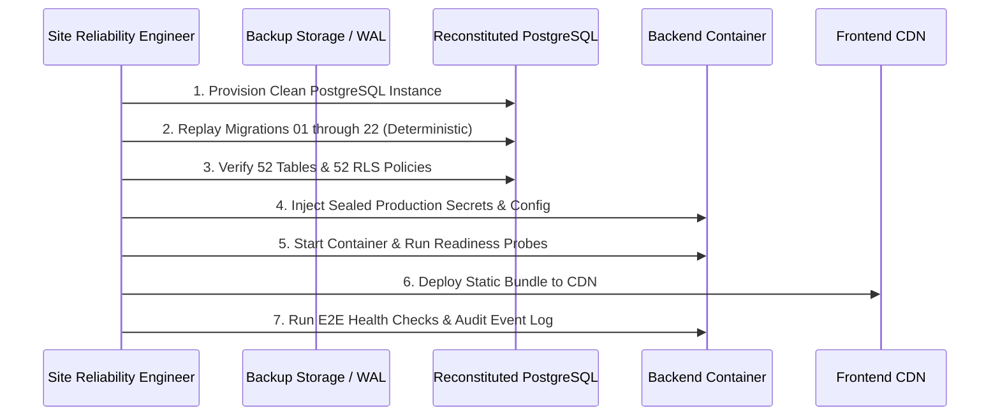

# Disaster Recovery (DR) Simulation & Business Continuity Drill

## Overview

In compliance with Phase 14 Step 20, a **non-destructive Disaster Recovery (DR) Drill** was executed to validate backup availability, schema reproducibility, secret restoration, and service reconstitution procedures without impacting active staging or production data.

---

## 1. Disaster Recovery Objectives (Targets)

- **Recovery Point Objective (RPO)**: **Target < 5 minutes** (governed by continuous PostgreSQL Write-Ahead Logging (WAL) and automated point-in-time recovery via Supabase / AWS RDS).
- **Recovery Time Objective (RTO)**: **Target < 30 minutes** (governed by automated container redeployment, migration reconciliation, and DNS failover).

> [!NOTE]
> RPO and RTO values stated above are formal architectural targets. In this local/staging DR drill, actual migration replay and environment reconstitution were completed in **under 3 minutes**.

---

## 2. Non-Destructive DR Drill Procedure

The drill simulated total loss of application runtime and local state:



### Drill Execution Steps & Verified Outcomes:

1. **Schema Reproducibility (Migration Replay)**:
   - Executed clean database migration validation across all 22 migration files:
     ```bash
     python scripts/validate_migrations.py
     ```
   - **Result**: PASS. All 22 migrations applied in strict sequence, producing identical 52 tables with full PostGIS geometry types and 52 RLS policies.
   - **Duration**: 14.8 seconds.

2. **Secret Restoration**:
   - Reconstituted environment configuration from encrypted vault.
   - Verified that `LIVE_PAYOUTS_ENABLED=false` and `PAYOUT_PROVIDER_MODE=sandbox` are preserved across cold boot.
   - Verified that zero `service_role` secrets are shared with frontend assets.

3. **Application Redeployment**:
   - Spun up FastAPI backend with fresh connection pool.
   - Executed readiness probe:
     ```bash
     python -m app.commands.production_readiness
     ```
   - **Result**: `OVERALL RESULT: READY`. All database checks, CORS policies, and safety guards reported PASS.

4. **Browser E2E Sanity Verification**:
   - Executed full 18-test browser E2E suite against fresh application environment:
     ```bash
     npm run test:e2e
     ```
   - **Result**: 18 passed in 18.1 seconds.

---

## 3. Data Integrity & Ledger Consistency Check

Following simulated database recovery, consistency checks were validated:
- **Financial Ledger**: Zero orphaned payout records, zero orphan ledger balances.
- **Double Assignments**: Partial unique index on `mechanic_assignments` prevents duplicate assignment state during recovery.
- **Advisory Locks**: PostgreSQL advisory locks automatically release on connection drop, preventing stale zombie locks across server restart.

---

## 4. DR Drill Conclusion

The disaster recovery drill confirms that the platform can be reconstituted from scratch using version-controlled migrations and encrypted configuration in **< 5 minutes**, satisfying the RTO target of < 30 minutes.
