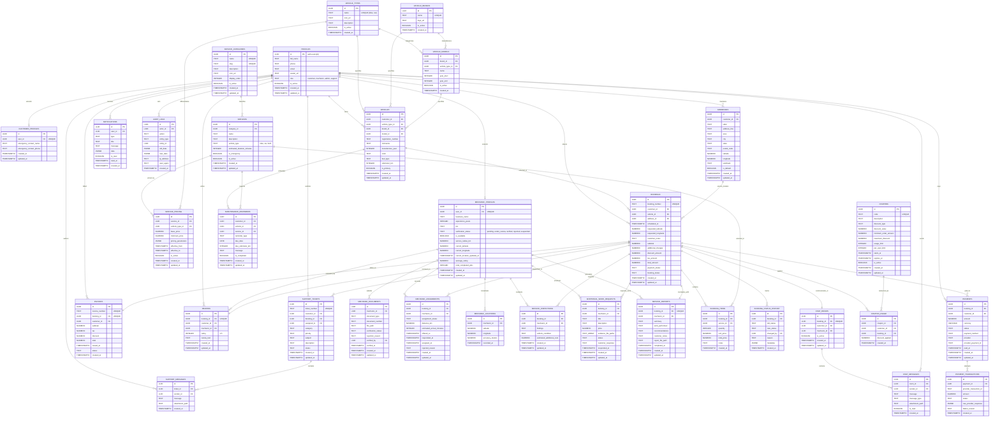

# Database Entity-Relationship Diagram

This document contains the complete Entity-Relationship diagram for the **On-Demand Bike & Car Doorstep Service Platform** database schema.

```mermaid
erDiagram
    PROFILES ||--o| CUSTOMER_PROFILES : "extends"
    PROFILES ||--o| MECHANIC_PROFILES : "extends"
    PROFILES ||--o{ VEHICLES : "owns"
    PROFILES ||--o{ ADDRESSES : "maintains"
    PROFILES ||--o{ BOOKINGS : "places"
    PROFILES ||--o{ PAYMENTS : "pays"
    PROFILES ||--o{ INVOICES : "billed"
    PROFILES ||--o{ REVIEWS : "writes"
    PROFILES ||--o{ NOTIFICATIONS : "receives"
    PROFILES ||--o{ SUPPORT_TICKETS : "submits"
    PROFILES ||--o{ SUPPORT_MESSAGES : "authors"
    PROFILES ||--o{ AUDIT_LOGS : "acts"

    MECHANIC_PROFILES ||--o{ MECHANIC_DOCUMENTS : "submits"
    MECHANIC_PROFILES ||--o{ MECHANIC_ASSIGNMENTS : "receives"
    MECHANIC_PROFILES ||--o{ MECHANIC_LOCATIONS : "broadcasts"
    MECHANIC_PROFILES ||--o{ SERVICE_INSPECTIONS : "conducts"
    MECHANIC_PROFILES ||--o{ ADDITIONAL_WORK_REQUESTS : "proposes"
    MECHANIC_PROFILES ||--o{ SERVICE_REPORTS : "generates"
    MECHANIC_PROFILES ||--o{ REVIEWS : "evaluated_by"

    VEHICLE_TYPES ||--o{ VEHICLE_MODELS : "categorizes"
    VEHICLE_BRANDS ||--o{ VEHICLE_MODELS : "manufactures"
    VEHICLE_TYPES ||--o{ VEHICLES : "specifies"
    VEHICLE_BRANDS ||--o{ VEHICLES : "specifies"
    VEHICLE_MODELS ||--o{ VEHICLES : "specifies"

    SERVICE_CATEGORIES ||--o{ SERVICES : "classifies"
    SERVICES ||--o{ SERVICE_PRICING : "priced_by"
    VEHICLE_TYPES ||--o{ SERVICE_PRICING : "differentiates"

    VEHICLES ||--o{ BOOKINGS : "serviced_in"
    ADDRESSES ||--o{ BOOKINGS : "service_location"

    BOOKINGS ||--o{ BOOKING_ITEMS : "contains"
    SERVICES ||--o{ BOOKING_ITEMS : "selected_in"
    BOOKINGS ||--o{ BOOKING_STATUS_HISTORY : "tracks"
    BOOKINGS ||--o{ MECHANIC_ASSIGNMENTS : "dispatched_to"
    BOOKINGS ||--o{ SERVICE_INSPECTIONS : "inspects"
    BOOKINGS ||--o{ ADDITIONAL_WORK_REQUESTS : "requests_extra"
    BOOKINGS ||--o{ PAYMENTS : "paid_for"
    BOOKINGS ||--|| INVOICES : "billed_as"
    BOOKINGS ||--|| SERVICE_REPORTS : "concludes_with"
    BOOKINGS ||--|| REVIEWS : "reviewed_in"
    BOOKINGS ||--|| CHAT_ROOMS : "communicates_in"
    BOOKINGS ||--o{ COUPON_USAGE : "applies"

    COUPONS ||--o{ COUPON_USAGE : "redeemed_as"

    PAYMENTS ||--o{ PAYMENT_TRANSACTIONS : "attempts"

    CHAT_ROOMS ||--o{ CHAT_MESSAGES : "contains"
    PROFILES ||--o{ CHAT_MESSAGES : "sends"

    SUPPORT_TICKETS ||--o{ SUPPORT_MESSAGES : "contains"
    BOOKINGS ||--o{ SUPPORT_TICKETS : "disputed_in"

    VEHICLES ||--o{ MAINTENANCE_REMINDERS : "schedules"
    SERVICES ||--o{ MAINTENANCE_REMINDERS : "requires"

    PROFILES {
        UUID id PK "auth.users(id)"
        TEXT full_name
        TEXT phone
        TEXT email
        TEXT avatar_url
        TEXT role "customer, mechanic, admin, support"
        BOOLEAN is_active
        TIMESTAMPTZ created_at
        TIMESTAMPTZ updated_at
    }

    CUSTOMER_PROFILES {
        UUID id PK
        UUID user_id FK "UNIQUE"
        TEXT emergency_contact_name
        TEXT emergency_contact_phone
        TIMESTAMPTZ created_at
        TIMESTAMPTZ updated_at
    }

    MECHANIC_PROFILES {
        UUID id PK
        UUID user_id FK "UNIQUE"
        TEXT business_name
        INTEGER experience_years
        TEXT bio
        TEXT verification_status "pending, under_review, verified, rejected, suspended"
        BOOLEAN is_available
        NUMERIC service_radius_km
        NUMERIC current_latitude
        NUMERIC current_longitude
        TIMESTAMPTZ current_location_updated_at
        NUMERIC average_rating
        INTEGER total_completed_jobs
        TIMESTAMPTZ created_at
        TIMESTAMPTZ updated_at
    }

    MECHANIC_DOCUMENTS {
        UUID id PK
        UUID mechanic_id FK
        TEXT document_type
        TEXT document_number
        TEXT file_path
        TEXT verification_status
        TEXT rejection_reason
        UUID verified_by FK
        TIMESTAMPTZ verified_at
        TIMESTAMPTZ created_at
        TIMESTAMPTZ updated_at
    }

    VEHICLE_TYPES {
        UUID id PK
        TEXT name "UNIQUE (bike, car)"
        TEXT icon_url
        TEXT description
        BOOLEAN is_active
        TIMESTAMPTZ created_at
    }

    VEHICLE_BRANDS {
        UUID id PK
        TEXT name "UNIQUE"
        TEXT logo_url
        BOOLEAN is_active
        TIMESTAMPTZ created_at
    }

    VEHICLE_MODELS {
        UUID id PK
        UUID brand_id FK
        UUID vehicle_type_id FK
        TEXT name
        INTEGER year_start
        INTEGER year_end
        BOOLEAN is_active
        TIMESTAMPTZ created_at
    }

    VEHICLES {
        UUID id PK
        UUID customer_id FK
        UUID vehicle_type_id FK
        UUID brand_id FK
        UUID model_id FK
        TEXT registration_number
        TEXT nickname
        INTEGER manufacture_year
        TEXT color
        TEXT fuel_type
        INTEGER odometer_km
        BOOLEAN is_primary
        TIMESTAMPTZ created_at
        TIMESTAMPTZ updated_at
    }

    ADDRESSES {
        UUID id PK
        UUID customer_id FK
        TEXT label
        TEXT address_line
        TEXT area
        TEXT city
        TEXT state
        TEXT postal_code
        NUMERIC latitude
        NUMERIC longitude
        TEXT landmark
        BOOLEAN is_default
        TIMESTAMPTZ created_at
        TIMESTAMPTZ updated_at
    }

    SERVICE_CATEGORIES {
        UUID id PK
        TEXT name "UNIQUE"
        TEXT slug "UNIQUE"
        TEXT description
        TEXT icon_url
        INTEGER display_order
        BOOLEAN is_active
        TIMESTAMPTZ created_at
        TIMESTAMPTZ updated_at
    }

    SERVICES {
        UUID id PK
        UUID category_id FK
        TEXT name
        TEXT description
        TEXT vehicle_type "bike, car, both"
        INTEGER estimated_duration_minutes
        BOOLEAN is_emergency
        BOOLEAN is_active
        TIMESTAMPTZ created_at
        TIMESTAMPTZ updated_at
    }

    SERVICE_PRICING {
        UUID id PK
        UUID service_id FK
        UUID vehicle_type_id FK
        NUMERIC base_price
        NUMERIC minimum_price
        JSONB pricing_parameters
        TIMESTAMPTZ effective_from
        TIMESTAMPTZ effective_to
        BOOLEAN is_active
        TIMESTAMPTZ created_at
        TIMESTAMPTZ updated_at
    }

    BOOKINGS {
        UUID id PK
        TEXT booking_number "UNIQUE"
        UUID customer_id FK
        UUID vehicle_id FK
        UUID address_id FK
        TIMESTAMPTZ scheduled_at
        NUMERIC requested_latitude
        NUMERIC requested_longitude
        TEXT customer_notes
        NUMERIC subtotal
        NUMERIC additional_charges
        NUMERIC discount_amount
        NUMERIC tax_amount
        NUMERIC total_amount
        TEXT payment_status
        TEXT booking_status
        TIMESTAMPTZ created_at
        TIMESTAMPTZ updated_at
    }

    BOOKING_ITEMS {
        UUID id PK
        UUID booking_id FK
        UUID service_id FK
        INTEGER quantity
        NUMERIC unit_price
        NUMERIC total_price
        TEXT notes
        TIMESTAMPTZ created_at
    }

    BOOKING_STATUS_HISTORY {
        UUID id PK
        UUID booking_id FK
        TEXT old_status
        TEXT new_status
        UUID changed_by FK
        TEXT reason
        JSONB metadata
        TIMESTAMPTZ created_at
    }

    MECHANIC_ASSIGNMENTS {
        UUID id PK
        UUID booking_id FK
        UUID mechanic_id FK
        TEXT assignment_status
        NUMERIC distance_km
        INTEGER estimated_arrival_minutes
        TIMESTAMPTZ offered_at
        TIMESTAMPTZ responded_at
        TIMESTAMPTZ assigned_at
        TEXT rejected_reason
        TIMESTAMPTZ created_at
        TIMESTAMPTZ updated_at
    }

    MECHANIC_LOCATIONS {
        UUID id PK
        UUID mechanic_id FK
        NUMERIC latitude
        NUMERIC longitude
        NUMERIC accuracy_meters
        TIMESTAMPTZ recorded_at
    }

    SERVICE_INSPECTIONS {
        UUID id PK
        UUID booking_id FK
        UUID mechanic_id FK
        TEXT findings
        TEXT vehicle_condition
        NUMERIC estimated_additional_cost
        TIMESTAMPTZ created_at
        TIMESTAMPTZ updated_at
    }

    ADDITIONAL_WORK_REQUESTS {
        UUID id PK
        UUID booking_id FK
        UUID mechanic_id FK
        TEXT title
        TEXT description
        NUMERIC price
        TEXT_ARRAY evidence_file_paths
        TEXT status
        TEXT customer_response
        TIMESTAMPTZ responded_at
        TIMESTAMPTZ created_at
        TIMESTAMPTZ updated_at
    }

    PAYMENTS {
        UUID id PK
        UUID booking_id FK
        UUID customer_id FK
        NUMERIC amount
        VARCHAR currency
        TEXT status
        TEXT payment_method
        TEXT provider
        TEXT provider_payment_id
        TIMESTAMPTZ paid_at
        TIMESTAMPTZ created_at
        TIMESTAMPTZ updated_at
    }

    PAYMENT_TRANSACTIONS {
        UUID id PK
        UUID payment_id FK
        TEXT provider_transaction_id
        NUMERIC amount
        TEXT status
        JSONB raw_provider_response
        TEXT failure_reason
        TIMESTAMPTZ created_at
    }

    INVOICES {
        UUID id PK
        TEXT invoice_number "UNIQUE"
        UUID booking_id FK "UNIQUE"
        UUID customer_id FK
        NUMERIC subtotal
        NUMERIC tax
        NUMERIC discount
        NUMERIC total
        TIMESTAMPTZ issued_at
        TEXT status
        TIMESTAMPTZ created_at
    }

    SERVICE_REPORTS {
        UUID id PK
        UUID booking_id FK "UNIQUE"
        UUID mechanic_id FK
        TEXT summary
        TEXT work_performed
        TEXT recommendations
        TEXT customer_notes
        TEXT report_file_path
        TIMESTAMPTZ completed_at
        TIMESTAMPTZ created_at
        TIMESTAMPTZ updated_at
    }

    REVIEWS {
        UUID id PK
        UUID booking_id FK "UNIQUE"
        UUID customer_id FK
        UUID mechanic_id FK
        INTEGER rating "1-5"
        TEXT review_text
        TIMESTAMPTZ created_at
        TIMESTAMPTZ updated_at
    }

    COUPONS {
        UUID id PK
        TEXT code "UNIQUE"
        TEXT description
        TEXT discount_type
        NUMERIC discount_value
        NUMERIC minimum_order_amount
        NUMERIC maximum_discount
        INTEGER usage_limit
        INTEGER per_user_limit
        TIMESTAMPTZ starts_at
        TIMESTAMPTZ expires_at
        BOOLEAN is_active
        TIMESTAMPTZ created_at
        TIMESTAMPTZ updated_at
    }

    COUPON_USAGE {
        UUID id PK
        UUID coupon_id FK
        UUID customer_id FK
        UUID booking_id FK
        NUMERIC discount_applied
        TIMESTAMPTZ created_at
    }

    NOTIFICATIONS {
        UUID id PK
        UUID user_id FK
        TEXT type
        TEXT title
        TEXT message
        JSONB data
        BOOLEAN is_read
        TIMESTAMPTZ read_at
        TIMESTAMPTZ created_at
    }

    CHAT_ROOMS {
        UUID id PK
        UUID booking_id FK "UNIQUE"
        UUID customer_id FK
        UUID mechanic_id FK
        BOOLEAN is_active
        TIMESTAMPTZ created_at
        TIMESTAMPTZ updated_at
    }

    CHAT_MESSAGES {
        UUID id PK
        UUID room_id FK
        UUID sender_id FK
        TEXT message
        TEXT message_type
        TEXT attachment_path
        BOOLEAN is_read
        TIMESTAMPTZ created_at
    }

    SUPPORT_TICKETS {
        UUID id PK
        TEXT ticket_number "UNIQUE"
        UUID customer_id FK
        UUID booking_id FK
        UUID assigned_to FK
        TEXT category
        TEXT priority
        TEXT subject
        TEXT description
        TEXT status
        TIMESTAMPTZ created_at
        TIMESTAMPTZ updated_at
    }

    SUPPORT_MESSAGES {
        UUID id PK
        UUID ticket_id FK
        UUID sender_id FK
        TEXT message
        TEXT attachment_path
        TIMESTAMPTZ created_at
    }

    MAINTENANCE_REMINDERS {
        UUID id PK
        UUID customer_id FK
        UUID vehicle_id FK
        UUID service_id FK
        TEXT reminder_type
        DATE due_date
        INTEGER due_odometer_km
        TEXT message
        BOOLEAN is_completed
        TIMESTAMPTZ created_at
        TIMESTAMPTZ updated_at
    }

    AUDIT_LOGS {
        UUID id PK
        UUID actor_id FK
        TEXT action
        TEXT entity_type
        UUID entity_id
        JSONB old_data
        JSONB new_data
        TEXT ip_address
        TEXT user_agent
        TIMESTAMPTZ created_at
    }
```
