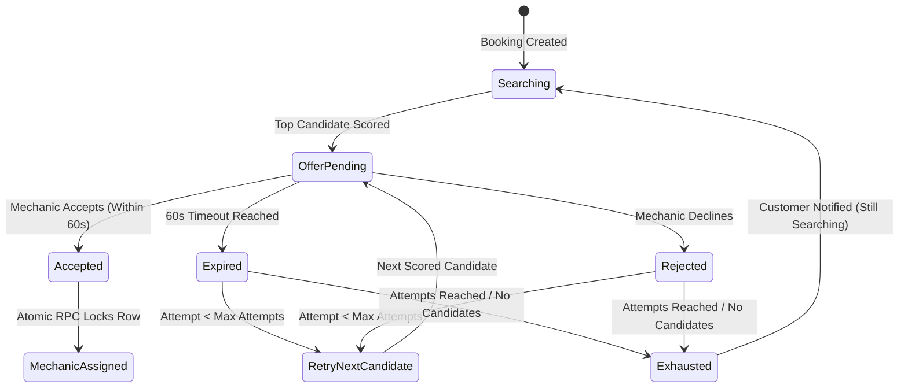

# Intelligent Mechanic Matching Engine (Phase 11)

## Overview
The VehicleCare Intelligent Mechanic Matching Engine automatically identifies, filters, and ranks qualified nearby mechanics for customer bookings. Rather than naively assigning the physically closest technician, the platform uses an **explainable, deterministic, multi-factor heuristic model** that balances proximity, technician availability, Bayesian smoothed ratings, reliability, current active workloads, and historical acceptance rates.

No machine learning models are used at this stage. All matching decisions are 100% deterministic, testable, auditable, and configurable.

---

## 1. Candidate Discovery & Eligibility Filtering

Matching strictly separates **eligibility** from **ranking**. Ineligible mechanics are filtered out before scoring:

```
Customer Booking Created
         ↓
PostGIS Geodesic Proximity Discovery (find_nearby_mechanics)
         ↓
Eligibility Filtering Gate:
  ├── 1. Account verified (verification_status = 'verified')
  ├── 2. Available status (availability_status = 'available' & is_available = true)
  ├── 3. Location Freshness: ping <= 30 minutes old
  ├── 4. Within service radius: geodesic_distance <= service_radius_km
  ├── 5. Workload capacity: active in-progress jobs < MAX_CONCURRENT_JOBS (default 1)
  ├── 6. Service capability: qualified for booking service/category
  └── 7. Non-disqualified: has not previously rejected/timed-out for this booking
         ↓
Explainable Multi-Factor Ranking
         ↓
Dispatch Offer to Candidate #1 (60s countdown)
```

---

## 2. Explainable Deterministic Scoring Formula

Each eligible mechanic is assigned an overall match score between `0.0000` and `1.0000` based on six normalized factor components:

$$\text{Match Score} = (w_d \times S_d) + (w_a \times S_a) + (w_r \times S_r) + (w_{rel} \times S_{rel}) + (w_w \times S_w) + (w_{acc} \times S_{acc})$$

### Configured Weights

| Factor | Weight ($w$) | Description |
| :--- | :---: | :--- |
| **Distance ($S_d$)** | `0.30` | Proximity normalized against mechanic's service radius |
| **Rating ($S_r$)** | `0.20` | Bayesian smoothed customer rating with neutral prior |
| **Availability ($S_a$)** | `0.15` | Operational readiness status (`1.0` if available, `0.0` otherwise) |
| **Reliability ($S_{rel}$)** | `0.15` | Historical job completion without cancellations or disputes |
| **Workload ($S_w$)** | `0.10` | Workload balancing: `1.0` (0 active jobs), `0.5` (1 active job) |
| **Acceptance ($S_{acc}$)** | `0.10` | Historical assignment offer acceptance rate |
| **Total** | **`1.00`** | Deterministic composite sum |

---

## 3. Mathematical Normalization Formulas

### A. Distance Score ($S_d$)
Distance uses straight-line geodesic distance on the WGS84 spheroid (calculated via PostGIS `ST_Distance` on `geography(Point, 4326)`):
$$S_d = \max\left(0, 1.0 - \frac{\text{distance\_km}}{\text{service\_radius\_km}}\right)$$

### B. Bayesian Smoothed Rating ($S_r$)
To prevent unfairly penalizing new mechanics who have zero customer reviews, the engine applies Bayesian prior smoothing:
$$\text{Smoothed Rating} = \frac{(N_{\text{reviews}} \times \bar{R}) + (w_{\text{prior}} \times R_{\text{prior}})}{N_{\text{reviews}} + w_{\text{prior}}}$$
- Neutral Prior Rating ($R_{\text{prior}}$): `3.5 / 5.0`
- Prior Weight ($w_{\text{prior}}$): `3.0`
- Normalized Rating Score:
$$S_r = \frac{\text{Smoothed Rating}}{5.0}$$
*A brand new mechanic with zero reviews receives a fair baseline score of $3.5 / 5.0 = 0.70$, preventing them from being starved of job offers.*

### C. Workload Balancing Score ($S_w$)
Prevents dispatching all jobs to a single high-rated mechanic:
- 0 active jobs: $S_w = 1.0$
- 1 active job: $S_w = 0.5$
- $\ge 2$ active jobs: Disqualified by eligibility filter

---

## 4. Offer Lifecycle & Sequential Retry Progression



1. **Offer Creation**: An assignment record is created with `assignment_status = 'offered'` and `expires_at = now() + 60s`.
2. **Mechanic Acceptance**: Mechanic clicks "Accept Job". Handled atomically via PostgreSQL RPC `accept_mechanic_assignment(assignment_id, mechanic_user_id)`. Row-level locks (`FOR UPDATE`) and partial unique index `idx_unique_accepted_assignment_per_booking` physically guarantee at most one accepted assignment per booking.
3. **Offer Rejection**: Handled atomically via `reject_mechanic_assignment`. Automatically retries with the next candidate in ranking.
4. **Offer Expiration**: Sweep routine identifies offers where `expires_at < now()`, marks them as `expired`, and automatically retries candidate #2 (and subsequently candidate #3).
5. **Session Exhaustion**: After 3 attempts or when all candidates reject/expire, the session enters `exhausted`, the booking remains in `searching_mechanic`, and the customer is notified ("Still looking for an available mechanic").

---

## 5. Admin Matching Dashboard
Platform operators can inspect matching operations at `/admin/matching`:
- Real-time list of matching sessions filtered by status (`searching`, `offer_pending`, `matched`, `exhausted`, `failed`).
- Explainability inspection modal:
  - Scored candidates ranked 1..N
  - Component score breakdowns (distance, rating, reliability, workload, acceptance)
  - Straight-line distance vs. Road transit ETA
  - Exact timeout or rejection reasons
