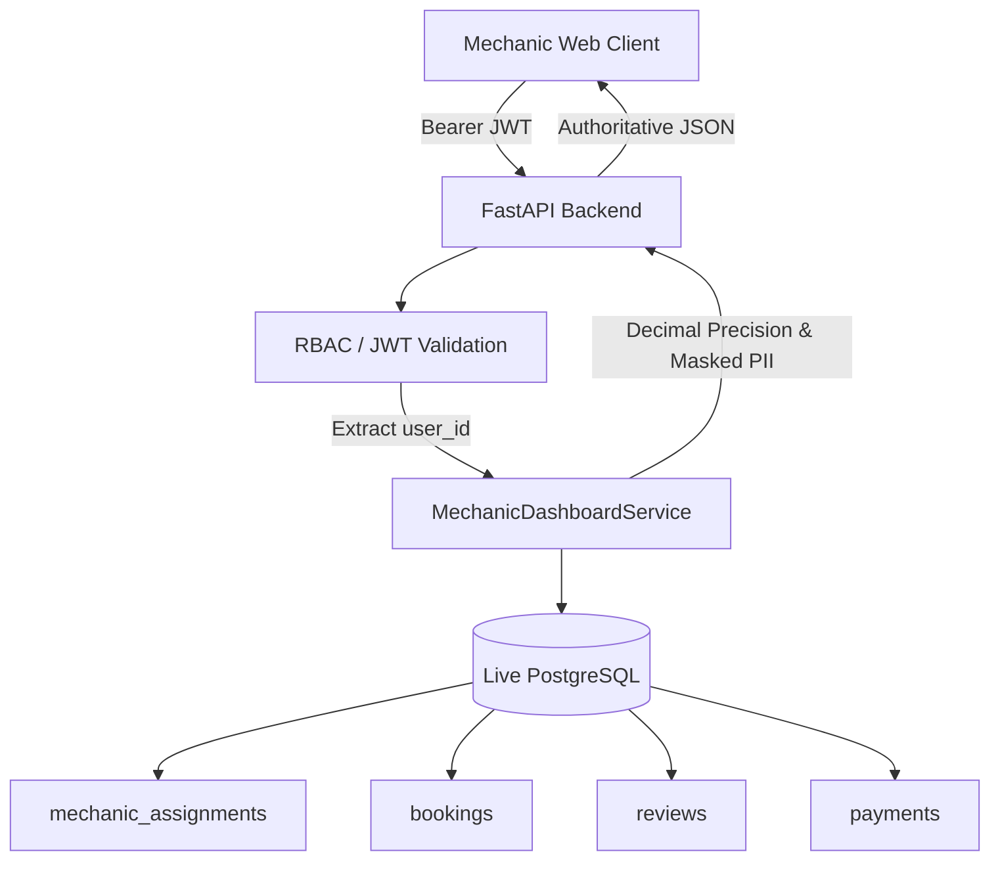

# Phase 8.6 — Mechanic Performance, Earnings & Dashboard

## 1. Architecture Overview

The Mechanic Performance, Earnings & Dashboard subsystem delivers an authoritative, operational, and financial command center for service mechanics on the Vehicle Service Platform.

The architecture strictly decouples frontend presentation from financial computation:
- **Authoritative Backend Data Source**: All metrics (job counts, earnings, ratings, and completion rates) are derived dynamically from PostgreSQL database records (`mechanic_assignments`, `bookings`, `reviews`, `payments`, and `mechanic_profiles`).
- **Zero Client-Side Financial Calculation**: The frontend never computes earnings or percentages independently.
- **Strict Role-Based Access Control**: Mechanic identity is authoritatively derived from the validated JWT subject UUID mapped to `public.mechanic_profiles.user_id`. Client-provided `mechanic_id` parameters are never trusted for mechanic sessions.
- **Privacy Preservation**: Customer private identifying information (email, phone number, full profile UUID, residential address) is strictly scrubbed and masked in all dashboard endpoints.



---

## 2. Authentication & Authorization

### Authentication
All dashboard endpoints require HTTP Bearer JWT authentication:
- Tokens are verified cryptographically via `app.core.security.verify_supabase_jwt`.
- Unauthenticated requests immediately reject with `401 Unauthorized`.

### Authorization & Cross-Mechanic Isolation
1. **Mechanic Users (`role == 'mechanic'`)**:
   - The mechanic profile UUID is resolved exclusively via `mechanic_profiles.user_id == authenticated_user.id`.
   - Any client-supplied `mechanic_id` query parameter is either ignored or checked for equality with the authenticated user's own profile. Any mismatch immediately aborts with `403 Forbidden` (`"Access denied: You can only view your own mechanic dashboard."`).
   - Mechanics cannot inspect peer mechanics' earnings, job lists, or reviews.
2. **Customer Users (`role == 'customer'`)**:
   - Customers attempting to access mechanic dashboard endpoints are immediately rejected with `403 Forbidden` (`"Access denied: Operation requires mechanic role."`).
3. **Admin and Support Users (`role in ['admin', 'support']`)**:
   - Platform administrators and support personnel can inspect any mechanic's dashboard by providing the required query parameter `?mechanic_id=<UUID>`.

---

## 3. Financial Model & Earnings Derivation

### Calculation Formula
All monetary operations are computed using Python `Decimal` with 2-decimal quantized precision (`Decimal("0.01")`). Floating-point arithmetic is strictly forbidden.

```text
gross_amount             = Decimal(booking.subtotal)
+ additional_work_amount = Decimal(booking.additional_charges)
- applicable_deductions  = Decimal("0.00") (Platform commission currently unmodeled)
-------------------------------------------------------------------------------
= net_attributable_amount = gross_amount + additional_work_amount - applicable_deductions
```

### Reconciliation with Existing Schema
- **Gross Service Amount**: Base labor/service charge from `bookings.subtotal`.
- **Additional Work**: Customer-approved supplementary work from `bookings.additional_charges` (derived from approved `additional_work_requests`).
- **Taxes & Platform Discounts**: Taxes (`bookings.tax_amount`) are government pass-through liabilities and are excluded from mechanic earnings. Promotional discounts (`bookings.discount_amount`) subsidized by the platform are kept isolated from mechanic revenue.
- **Net Earnings Status**:
  - `paid`: Bookings where `payment_status == 'paid'` or `booking_status == 'paid'`. Summed into `total_earnings`.
  - `pending`: Completed services (`booking_status in ['service_completed', 'payment_pending']`) where payment has not settled yet and is not marked failed/refunded. Summed into `pending_earnings`.
  - `failed`: Payment gateway failures are completely excluded from earnings totals.
  - `refunded`: Refunded bookings (`payment_status == 'refunded'`) are completely excluded from earnings totals.

---

## 4. Performance & Operational Metrics

### Job Completion Rate
To avoid distorting operational efficiency with currently running work, active jobs are excluded from the completion denominator:

$$\text{Completion Rate} = \frac{\text{Completed Jobs}}{\text{Completed Jobs} + \text{Cancelled Jobs}} \times 100$$

- **Completed Jobs**: Bookings in `['service_completed', 'payment_pending', 'paid']` where assignment status is `accepted` or `completed`.
- **Cancelled Jobs**: Bookings in `['cancelled']` where assignment status is `accepted` or `cancelled`.
- **Division by Zero Safety**: If $\text{Completed Jobs} + \text{Cancelled Jobs} == 0$, completion rate safely defaults to `0.0%`.

### Rating Calculation & Distribution
- Calculated across `public.reviews` for `mechanic_id`.
- Average rating is rounded to 2 decimal places.
- Rating distribution aggregates review counts into discrete buckets: `{"1": n, "2": n, "3": n, "4": n, "5": n}`.
- Empty State: When `review_count == 0`, the UI renders `"No reviews yet"` instead of a misleading `"0.0 stars"`.

---

## 5. API Reference

### 1. GET `/api/v1/mechanics/dashboard/overview`
Retrieves top-level KPIs for the mechanic.

**Response (200 OK)**:
```json
{
  "today": {
    "jobs": 4,
    "completed": 2,
    "cancelled": 1
  },
  "active_jobs": 1,
  "completed_jobs": 4,
  "cancelled_jobs": 1,
  "total_earnings": "1500.75",
  "pending_earnings": "800.00",
  "average_rating": 4.67,
  "review_count": 3,
  "completion_rate": 80.0
}
```

### 2. GET `/api/v1/mechanics/dashboard/performance`
Retrieves performance statistics and star rating breakdown.

**Query Parameters**:
- `from_date` (optional): ISO date string (`YYYY-MM-DD` or timestamp).
- `to_date` (optional): ISO date string.
- `mechanic_id` (optional): Target mechanic UUID (admin/support only).

**Response (200 OK)**:
```json
{
  "total_jobs": 5,
  "completed_jobs": 4,
  "cancelled_jobs": 1,
  "active_jobs": 1,
  "completion_rate": 80.0,
  "average_rating": 4.67,
  "review_count": 3,
  "rating_distribution": {
    "1": 0,
    "2": 0,
    "3": 0,
    "4": 1,
    "5": 2
  },
  "monthly_breakdown": [
    {
      "month": "2026-10",
      "completed": 2,
      "cancelled": 1,
      "earnings": "1500.75"
    }
  ]
}
```

### 3. GET `/api/v1/mechanics/dashboard/earnings`
Retrieves paginated, itemized booking earnings.

**Query Parameters**:
- `from_date` (optional): ISO date string.
- `to_date` (optional): ISO date string.
- `status` (optional): Filter by `all`, `paid`, `pending`, `refunded`, `failed`.
- `limit` (optional): Page size, clamped between 1 and 100 (default 20).
- `offset` (optional): Offset integer $\ge 0$ (default 0).

**Response (200 OK)**:
```json
{
  "items": [
    {
      "booking_id": "b1b1b1b1-b1b1-b1b1-b1b1-b1b1b1b1b1b1",
      "booking_number": "BK-M1-001",
      "completed_at": "2026-10-03T11:00:00Z",
      "gross_amount": "1200.50",
      "additional_work_amount": "300.25",
      "deductions": "0.00",
      "net_amount": "1500.75",
      "payment_status": "paid",
      "paid_at": "2026-10-03T11:00:00Z"
    }
  ],
  "total": 1,
  "limit": 20,
  "offset": 0
}
```

### 4. GET `/api/v1/mechanics/dashboard/recent-jobs`
Retrieves recent jobs with vehicle and service summary. Customer PII is completely excluded.

**Response (200 OK)**:
```json
{
  "items": [
    {
      "booking_id": "b1b1b1b1-b1b1-b1b1-b1b1-b1b1b1b1b1b1",
      "booking_number": "BK-M1-001",
      "service_summary": "Vehicle Service",
      "vehicle_summary": "Vehicle",
      "booking_status": "paid",
      "assignment_status": "accepted",
      "scheduled_at": "2026-10-03T10:00:00Z",
      "amount": "1500.75",
      "payment_status": "paid"
    }
  ],
  "total": 1,
  "limit": 10,
  "offset": 0
}
```

### 5. GET `/api/v1/mechanics/dashboard/recent-reviews`
Retrieves recent customer reviews with privacy-safe name masking (e.g. `"John D."`).

**Response (200 OK)**:
```json
{
  "items": [
    {
      "id": "r1r1r1r1-r1r1-r1r1-r1r1-r1r1r1r1r1r1",
      "booking_id": "b1b1b1b1-b1b1-b1b1-b1b1-b1b1b1b1b1b1",
      "rating": 5,
      "review_text": "Excellent work!",
      "customer_name": "John D.",
      "created_at": "2026-10-03T12:00:00Z"
    }
  ],
  "total": 1,
  "limit": 10,
  "offset": 0
}
```

---

## 6. Frontend Architecture & Design System

The frontend dashboard is implemented in React 18, TypeScript, TailwindCSS, and TanStack React Query:
- **`MechanicDashboardPage.tsx`**: Central responsive page implementing desktop (multi-column), tablet (2-column), and mobile (single column) views.
- **`OverviewCards.tsx`**: Top-level KPI overview with sub-counts for completed and cancelled jobs.
- **`PerformanceSummary.tsx`**: Operational reliability KPIs and monthly trend tables.
- **`RatingDistribution.tsx`**: 1-to-5 star bar visualizer with percentage breakdowns and `"No reviews yet"` empty guards.
- **`EarningsSummary.tsx`**: Itemized payout table with status tabs and pagination controls.
- **`RecentJobs.tsx` & `RecentReviews.tsx`**: Real-time activity feeds with privacy protection.
- **`DateFilterBar.tsx`**: Preset selectors (`Today`, `7 Days`, `30 Days`, `This Month`, `Custom Range`) with UTC-safe date formatting.

---

## 7. Known Limitations & Future Payout Ledger Architecture

1. **Current Schema Limitations**:
   - The current database schema does not store a platform commission rate (e.g. 15% or 20%) or an automated payout ledger table (`mechanic_payouts`).
   - Consequently, mechanic net earnings currently equal `subtotal + additional_charges` (with zero platform deduction).
2. **Future Architecture Plan (Phase 9 Payout Ledger)**:
   - When platform commissions are introduced, create an authoritative `public.mechanic_payout_ledger` table with double-entry accounting records (`booking_id`, `mechanic_id`, `gross_credit`, `platform_commission_debit`, `net_payout_amount`, `disbursement_status`, `bank_payout_batch_id`).
   - `MechanicDashboardService.get_earnings()` is structured so the `deductions` field will cleanly incorporate the commission debit without breaking client contracts or database integrity.
