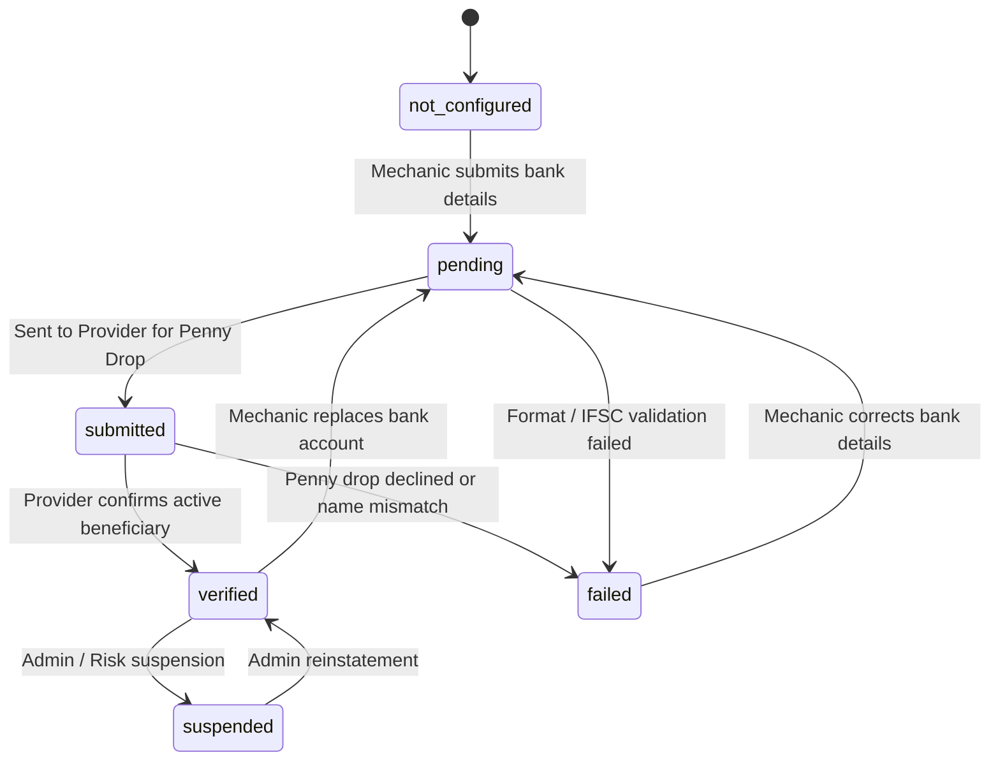

# Mechanic Banking Onboarding & Payout Account Architecture (Phase 8.8)

**Target System:** Vehicle Service Platform  
**Target Database:** Supabase (`dfigtryvvujhwuiyzdvs`)  
**Scope:** Mechanic bank account registration, validation, Penny Drop verification, and lifecycle management.

---

## 1. Banking Data Model & Security Architecture

### 1.1 Sensitive Data Minimization
Under Reserve Bank of India (RBI) and global financial security best practices, storing plain-text bank account numbers or credentials on primary application databases creates unnecessary vulnerability.

The platform implements strict data minimization:
1. **Zero Raw Account Storage:** Plain bank account numbers are accepted only during transient HTTPS request execution.
2. **Masked Storage:** The database table `public.mechanic_payout_accounts` stores only the masked representation:
   - Example: `•••• •••• 5678` (only the last 4 digits are retained for UI display and bank verification).
3. **One-Way Account Hash:** A SHA-256 hash of the account number is stored (`account_number_hash`) to safely detect duplicate accounts and prevent multi-account payout abuse.
4. **Provider References:** The regulated payout provider's tokenized references (`provider_contact_id` and `provider_fund_account_id`) are stored to execute future disbursements without retaining plaintext account details.
5. **Redacted Logs:** Application loggers explicitly filter account numbers and print only masked strings (`••••5678`).

### 1.2 Table Schema (`public.mechanic_payout_accounts`)
- `id` (UUID, Primary Key)
- `mechanic_id` (UUID, Foreign Key → `mechanic_profiles(id)`)
- `provider` (TEXT, default `'razorpayx'`)
- `provider_contact_id` (TEXT, nullable)
- `provider_fund_account_id` (TEXT, nullable)
- `account_holder_name` (TEXT, NOT NULL)
- `account_type` (TEXT, default `'bank_account'`)
- `masked_account_number` (TEXT, NOT NULL, format: `•••• •••• {last4}`)
- `account_number_hash` (TEXT, SHA-256 for deduplication)
- `ifsc_code` (TEXT, validated via regex: `^[A-Z]{4}0[A-Z0-9]{6}$`)
- `bank_name` (TEXT, nullable)
- `verification_status` (TEXT, CHECK constraint: `not_configured`, `pending`, `submitted`, `verified`, `failed`, `suspended`)
- `verification_error` (TEXT, sanitized failure message)
- `is_primary` (BOOLEAN, default `true`)
- `is_active` (BOOLEAN, default `true`)
- `verified_at` (TIMESTAMPTZ, nullable)
- `last_verified_at` (TIMESTAMPTZ, nullable)
- `metadata` (JSONB, default `{}`)
- `created_at` / `updated_at` (TIMESTAMPTZ, automatic trigger)

---

## 2. Verification State Machine

The payout account verification lifecycle is strictly governed by an explicit state machine:

### 2.1 State Transition Matrix

| Initial State | Target State | Permitted Actor | Requirement / Precondition |
|---|---|---|---|
| `not_configured` | `pending` | Mechanic / Admin | Bank details submitted & regex validated |
| `pending` | `submitted` | Backend / Provider | Provider contact & fund account created |
| `submitted` | `verified` | Trusted Provider / Admin | Successful ₹1 penny drop & name verification |
| `submitted` | `failed` | Trusted Provider / Admin | Beneficiary bank rejection or mismatch |
| `pending` | `failed` | Backend | Invalid IFSC or bank validation error |
| `failed` | `pending` | Mechanic / Admin | Replacement / updated bank details submitted |
| `verified` | `pending` | Mechanic / Admin | Account replaced with new bank details |
| `verified` | `suspended` | Admin / Risk | Fraud risk or KYC review trigger |
| `suspended` | `verified` | Admin / Risk | Compliance clearance |

### 2.2 Client-Side Self-Verification Prevention
- **Security Rule:** A client request (mechanic JWT) can **never** set `verification_status` to `'verified'`.
- Attempts to pass `'verified'` via API payloads are stripped and rejected by Pydantic schema validation.
- Database Row Level Security (RLS) restricts authenticated mechanic `UPDATE` queries on `mechanic_payout_accounts` to rows where `verification_status IN ('not_configured', 'pending', 'submitted')` and prevents modifying administrative verification columns.

---

## 3. Penny Drop Verification Workflow

1. **Trigger:** Mechanic initiates penny drop via frontend button or backend automated onboarding.
2. **Provider Dispatch:** Backend calls `POST /v1/fund_accounts/validations` through `RazorpayXProvider`.
3. **Execution:** The provider executes a ₹1 clearing transaction to the target bank account via IMPS.
4. **Beneficiary Match:** The destination bank returns the registered account holder name according to core banking records.
5. **Fuzzy Match Evaluation:**
   - If registered name matches submitted account holder name: status set to `verified`, `verified_at` stamped.
   - If mismatch or inactive account: status set to `failed`, sanitized explanation recorded in `verification_error`.
6. **Audit Trail:** An immutable audit log entry is written to `public.audit_logs`.

---

## 4. Backend API Endpoints

- `GET /api/v1/mechanics/payout-account`: Returns active payout account (masked).
- `POST /api/v1/mechanics/payout-account`: Onboard or replace bank details (returns masked response).
- `PATCH /api/v1/mechanics/payout-account`: Update non-sensitive bank metadata.
- `POST /api/v1/mechanics/payout-account/verification`: Trigger automated Penny Drop verification.

---

## 5. Frontend User Experience

- **Page URL:** `/mechanic/payout-account` (Protected route).
- **Navigation:** Accessible from Mechanic Dashboard and Payout Ledger pages.
- **Onboarding Form:** Includes client-side validations for IFSC formatting, 9–18 digit account numbers, account number re-entry confirmation, and mandatory legal consent.
- **Status Dashboard:** Shows masked account number (`•••• 5678`), bank name, IFSC, verification status badge, last verified timestamp, and penny-drop trigger.
- **Replacement Flow:** Mechanics can click "Replace Bank Account" to switch to replacement mode with clear warnings about pending re-verification.
