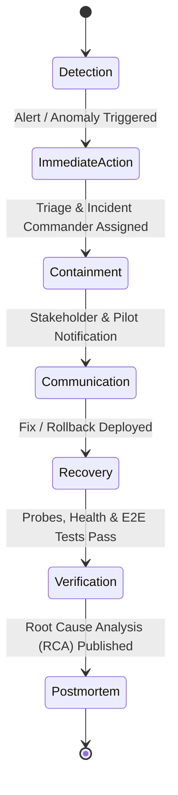

# Production Incident Response Runbook & Severity Matrix

## Overview

This runbook defines the operational protocol, severity classifications, and response workflows for handling production incidents on the **VehicleCare** platform.

---

## 1. Incident Severity Classification

| Severity | Definition | Response SLA | Target Resolution | Escalation Group |
| :--- | :--- | :--- | :--- | :--- |
| **SEV-1 (Critical)** | Total platform outage, security breach, unauthorized data access, financial ledger corruption, or live money leakage. | **< 5 minutes** | **< 30 minutes** | Incident Commander, Lead Architect, Security Lead |
| **SEV-2 (Major)** | Major user-facing capability down (e.g. matching engine failure, booking creation blocked, realtime tracking offline). | **< 15 minutes** | **< 2 hours** | On-Call SRE, Core Backend/Frontend Engineers |
| **SEV-3 (Moderate)**| Partial degradation with active fallback (e.g. OSRM circuit breaker open using Haversine, non-blocking notification retries). | **< 1 hour** | **< 8 hours** | Feature Team, Operations On-Call |
| **SEV-4 (Minor)** | Minor cosmetic or non-blocking operational defect (e.g. minor UI alignment glitch, low-priority dashboard chart lag). | **< 1 business day** | **Next Sprint** | Engineering Product Backlog |

---

## 2. Seven-Stage Incident Response Lifecycle



### Stage 1: Detection
- Automated alerts triggered from `/health/ready`, `AutonomousJobRunner` failures, or GPS anomaly threshold spikes.
- Manual reports logged via Operations Dashboard.

### Stage 2: Immediate Action
- On-call engineer acknowledges alert within SLA.
- Classifies severity and opens incident war room.

### Stage 3: Containment
- If SEV-1 security or financial risk:
  - Freeze active pilot dispatches.
  - Disable mechanic offer generation via feature flag or admin toggle.
  - Enforce zero payout rule verification (`LIVE_PAYOUTS_ENABLED=false`).

### Stage 4: Communication
- Status update posted to operational status channel every 30 minutes for SEV-1, every 60 minutes for SEV-2.
- Pilot participants notified via in-app banner or SMS broadcast.

### Stage 5: Recovery
- Execute roll-forward patch or trigger rollback procedure:
  - Frontend CDN rollback to prior static bundle hash.
  - Backend container rollback to prior stable image tag.
  - Database schema remains backward-compatible.

### Stage 6: Verification
- Execute automated readiness probes:
  ```bash
  python -m app.commands.production_readiness
  pytest tests/test_deployment_smoke.py
  npm run test:e2e
  ```
- Confirm zero lingering anomalies in Operations Dashboard.

### Stage 7: Postmortem (Blameless RCA)
- Published within 48 hours for SEV-1/SEV-2.
- Documents: Timeline, Root Cause, Impact, Corrective Actions, Preventive Measures.
