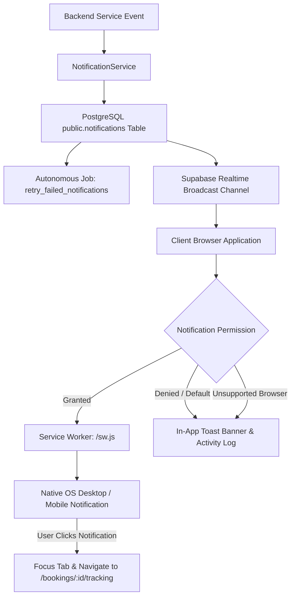

# Production Push Notifications & Service Worker Architecture Report

## Overview

In response to the operational limitation noted in Phase 14, Phase 15 implements an HTTPS-compliant, service-worker-backed browser notification architecture for **VehicleCare**. The design guarantees that operational state updates are reliably delivered through native OS/browser notifications when permitted, while remaining completely functional through in-app channels when notifications are denied, revoked, or unsupported.

---

## 1. Notification Architecture

---

## 2. Service Worker Implementation (`frontend/public/sw.js`)

The production service worker:
1. **Listens to `push` events**: Extracts server-sent JSON payload (`title`, `body`, `icon`, `url`, `tag`) and triggers `self.registration.showNotification()`.
2. **Listens to `notificationclick` events**: Automatically focuses an existing browser tab running VehicleCare or launches a new browser window directed to the target booking route (`/bookings/:id/tracking` or `/dashboard`).
3. **Caches Zero Dynamic State**: Adheres to security rules; does not cache private customer data or tokens.

---

## 3. Client Notification Manager (`frontend/src/lib/notifications.ts`)

Provides typed helper functions:
- `isPushNotificationSupported()`: Verifies `Notification` and `navigator.serviceWorker` support.
- `getNotificationPermission()`: Returns `'granted' | 'denied' | 'default' | 'unsupported'`.
- `requestNotificationPermission()`: Safely prompts user for permission.
- `registerPushServiceWorker()`: Registers `/sw.js` under root scope.
- `showBrowserNotification()`: Dispatches native notification or falls back silently to in-app rendering.

---

## 4. Resilience & Fallback Guarantees

1. **Non-Blocking Delivery**: A failed or blocked notification never rolls back a booking transaction, payment record, or mechanic dispatch.
2. **In-App Primary State**: The customer dashboard, live tracking view, and mechanic workbench continuously receive state updates via Supabase Realtime WebSocket channels and TanStack React Query polling.
3. **Autonomous Retry Worker**: Unsent or failed notifications are retried automatically up to 3 times with exponential backoff by the `retry_failed_notifications` background job.
