# Release Engineering & Deployment Lifecycle (Phase 10)

This document formalizes the 10-stage release workflow for moving code from local feature development to live production deployment with explicit financial and operational safety gates.

---

## 1. Ten-Stage Release Pipeline

```mermaid
flowchart LR
    S1[1. Dev Branch] --> S2[2. Pull Request]
    S2 --> S3[3. CI Pipeline]
    S3 --> S4[4. Peer Review]
    S4 --> S5[5. Staging Deploy]
    S5 --> S6[6. Staging Smoke]
    S6 --> S7[7. Prod Approval Gate]
    S7 --> S8[8. Prod Deployment]
    S8 --> S9[9. Post-Deploy Verify]
    S9 --> S10[10. Monitor / Rollback]
```

### Stage 1: Developer Branch
- Feature branches branched from `develop` or `main` using naming convention `feature/<name>` or `fix/<name>`.
- Local tests passing (`pytest` and `vitest run`).
- Migrations created sequentially in `supabase/migrations/`.

### Stage 2: Pull Request
- PR opened targeting `main` or `staging`.
- Automated PR template completed verifying:
  - No secrets committed in source code or `.env`.
  - No destructive migrations (`DROP TABLE`, `TRUNCATE`).
  - No real-money payout flags enabled.

### Stage 3: CI Pipeline Execution
GitHub Actions workflow `.github/workflows/ci.yml` executes:
1. Backend test suite (`pytest`) -> 421+ tests passing.
2. Frontend test suite (`vitest`) -> 82 tests passing.
3. Frontend build & typecheck (`tsc && vite build`).
4. Quality & configuration matrix check (`test_environment_validation.py`).
5. Security & secret exposure scanner (`verify_secret_exposure.py`).
6. Production readiness evaluator (`production_readiness.py`).
7. Docker image build verification.
Failure in any job halts the pipeline immediately (fail-fast).

### Stage 4: Peer Review & Governance
- Minimum 1 senior engineer approval required.
- Database migration review: verify SQL statements for non-blocking index creation (`CONCURRENTLY`), backwards compatibility, and idempotent RPC definitions.

### Stage 5: Staging Deployment
- Deployed to pre-production cluster via `.github/workflows/deploy-staging.yml`.
- Connects to Supabase staging database.
- Strictly isolated sandbox credentials (Razorpay test keys, sandbox payout mode).
- Wildcard CORS forbidden.

### Stage 6: Staging Smoke Testing & UAT
- Execution of automated smoke test suite (`pytest tests/test_deployment_smoke.py`).
- Manual verification of booking lifecycle and admin dashboard (`/admin/operations`).
- Confirmation that no real-money transactions are dispatched.

### Stage 7: Production Approval Gate (Financial Safety Check)
Explicit human sign-off required prior to production deployment:
- [ ] `LIVE_PAYOUTS_ENABLED` confirmed **false**.
- [ ] Payout provider mode confirmed **sandbox** or explicitly authorized.
- [ ] Razorpay webhook endpoints configured with secure secret in Razorpay Dashboard.
- [ ] Database backup snapshot verified.
- [ ] Migration rollback and recovery strategy identified.

### Stage 8: Production Deployment
- Deployed via `.github/workflows/deploy-production.yml` or tagged release.
- Frontend static assets synced to production CDN with immutable caching on `/assets/*`.
- Backend container deployed with zero-downtime rolling update strategy (minimum 2 replicas active).

### Stage 9: Post-Deployment Verification
Automated probe checks:
- `GET /health/live` -> HTTP 200 `{"status": "ok"}`
- `GET /health/ready` -> HTTP 200 `{"status": "ready"}`
- `GET /health/database` -> HTTP 200 `{"status": "connected"}`
- Smoke test execution against production API endpoints.

### Stage 10: Continuous Monitoring & Rollback Readiness
- Monitor structured logs for error classification spikes.
- Monitor request IDs and latency.
- If anomalies are detected, execute formal rollback procedures.

---

## 2. Reversible Rollback Strategies

### 2.1. Frontend Rollback
- Immediate CDN rollback: Re-point CDN edge origin to previous immutable build commit hash or restore previous `dist/` release artifact.
- Effective duration: < 60 seconds.

### 2.2. Backend Rollback
- Re-deploy previous container image tag (`vehicle-service-backend:<previous_tag>`).
- Container runtime performs graceful rolling drain of traffic to prior known healthy containers.
- Effective duration: < 2 minutes.

### 2.3. Database Rollback Strategy
> [!IMPORTANT]
> **No Blind Down-Migrations**:
> Automatic down migrations (`DROP TABLE`, `ROLLBACK`) risk irreversible data loss on active production systems. The platform enforces a forward-fix rollback philosophy:
> 1. **Backwards Compatible Additions**: All schema migrations must be additive (new nullable columns, new tables, new views).
> 2. **Forward-Fix Patches**: If an RPC or policy fails, create a new numbered forward migration that alters or updates the function.
> 3. **Disaster Snapshot Restore**: If a critical corruption occurs, restore from the verified Point-In-Time-Recovery (PITR) backup snapshot.

### 2.4. Financial Anomaly Remediation
- Never manually mutate ledger items (`mechanic_payout_ledger`) or batch records directly to make dashboards look clean.
- Run `ReconciliationService` to identify discrepant records.
- Financial corrections must be audited and recorded via audit log entries.
