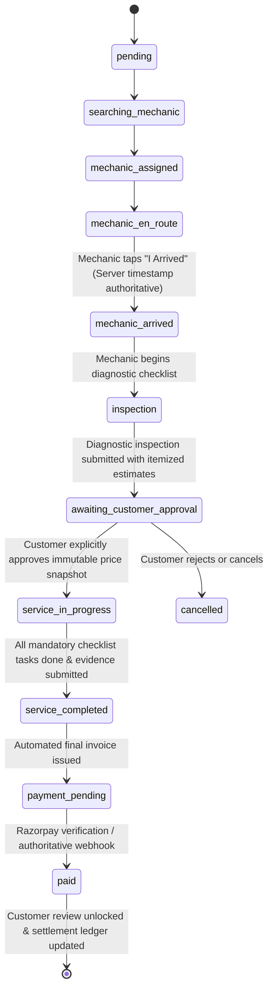

# Phase 12: Production-Grade Vehicle Service Operations

## 1. Overview & Operational Lifecycle
The VehicleCare doorstep service workflow provides a continuous, secure, and auditable operational journey:

---

## 2. Canonical State Machine Verification
All backend transitions enforce:
- **Authorized Actor Verification**: Mechanics can only mutate bookings assigned to them; customers can only approve/reject their own bookings; admins retain operational oversight.
- **Valid Transition Guards**: Prevent illegal skips (e.g. attempting to jump from `mechanic_en_route` directly to `service_completed`).
- **Audit Logging**: Every state change records `actor_id`, `from_status`, `to_status`, `metadata`, and authoritative PostgreSQL server timestamps (`CURRENT_TIMESTAMP`).
- **Idempotent Notifications**: Triggered via `NotificationService` for customer and mechanic push/in-app updates.

---

## 3. Arrival Workflow
- **Endpoint**: `POST /api/v1/bookings/{booking_id}/arrive`
- **Validation**:
  - The caller must be the assigned mechanic for the booking (`assignment.mechanic_id == user.id`).
  - The booking must currently be in state `mechanic_en_route`.
  - The server generates the arrival timestamp; frontend timestamps are ignored.
- **Transition**: `mechanic_en_route` $\rightarrow$ `mechanic_arrived`.
- **Side Effects**:
  - Logs `booking_audit_logs` entry.
  - Sends immediate customer notification: *"Your mechanic has arrived at your doorstep."*

---

## 4. Service Execution Workbench
Once the customer approves the estimate (`awaiting_customer_approval` $\rightarrow$ `service_in_progress`):
1. **Interactive Checklist**: Loaded dynamically from `service_checklist_templates` based on requested services (e.g. Brakes, Battery, Engine). Each task is toggled with `PATCH /api/v1/bookings/{id}/checklist/{item_id}`.
2. **Parts Tracking**: Any replacement parts installed are recorded with `POST /api/v1/bookings/{id}/parts`, capturing part name, part number, quantity, unit price, and warranty details.
3. **Completion Gating**: The mechanic taps "Complete Service". The backend validates:
   - Every checklist item marked `is_mandatory = TRUE` has `is_completed = TRUE`.
   - No `additional_work_requests` remain in `pending` state.
   - Required work summary and completion notes are provided.
4. **Transition**: `service_in_progress` $\rightarrow$ `service_completed`.
5. **Invoice & Service Report Generation**: Automatically writes `service_reports` and calls `PaymentService.create_invoice_for_booking`, transitioning the booking to `payment_pending`.

---

## 5. Review & Rating Eligibility
- Backend review creation allows bookings in `service_completed`, `payment_pending`, and `paid`.
- Database RLS policy on `public.reviews` has been explicitly updated in migration `20261004000022_vehicle_service_operations.sql` to include `IN ('service_completed', 'payment_pending', 'paid')`, preventing permission denial bugs while strictly prohibiting duplicate reviews per booking.

---

## 6. Financial & Payout Safety
- `LIVE_PAYOUTS_ENABLED=false` and `PAYOUT_PROVIDER_MODE=sandbox` remain hard-enforced.
- No direct database mutations or deletions on ledger tables.
- All financial balances are calculated strictly through immutable snapshots and the double-entry payout ledger.
