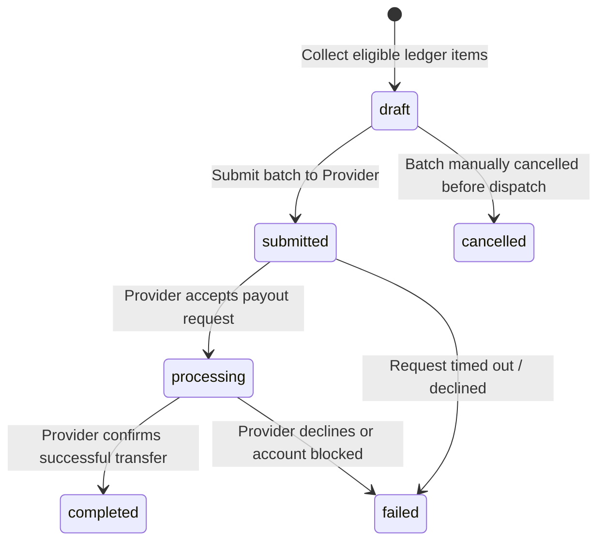

# Settlement Batches & Webhook Reconciliation Architecture (Phase 8.8)

**Target System:** Vehicle Service Platform  
**Target Database:** Supabase (`dfigtryvvujhwuiyzdvs`)  
**Scope:** Automated settlement batching, provider disbursement execution, webhook reconciliation, and failure handling.

---

## 1. Settlement Batch Data Model

### 1.1 Architecture & Objectives
Settlement batching groups eligible mechanic payout ledger entries into consolidated, auditable disbursement batches.

Key objectives:
1. **Financial Integrity:** Prevent duplicate disbursements across multiple batches.
2. **Atomic Batch Membership:** Each ledger record points to at most one active settlement batch via `mechanic_payout_ledger.settlement_batch_id`.
3. **Idempotent Dispatch:** Every batch payout execution uses a deterministically generated UUIDv4 idempotency key passed to the provider's `X-Payout-Idempotency` header.
4. **Reconciliation Traceability:** Provider payout IDs (`pout_...`) and webhook events map directly back to ledger items and settlement batches.

### 1.2 Table Schema (`public.settlement_batches`)
- `id` (UUID, Primary Key)
- `batch_number` (TEXT, UNIQUE, format: `BATCH-YYYYMMDD-XXXX`)
- `provider` (TEXT, default `'razorpayx'`)
- `status` (TEXT, CHECK: `draft`, `submitted`, `processing`, `completed`, `partially_failed`, `failed`, `cancelled`)
- `total_amount` (NUMERIC(12,2), CHECK `total_amount >= 0`)
- `currency` (TEXT, default `'INR'`)
- `item_count` (INTEGER, CHECK `item_count >= 0`)
- `provider_batch_id` (TEXT, nullable)
- `error_details` (JSONB, sanitized failure diagnostics)
- `metadata` (JSONB)
- `created_by` (UUID, nullable, Foreign Key → `profiles(id)`)
- `submitted_at` (TIMESTAMPTZ, nullable)
- `completed_at` (TIMESTAMPTZ, nullable)
- `created_at` / `updated_at` (TIMESTAMPTZ, automatic trigger)

---

## 2. Settlement Batch State Machine



### 2.1 State Transitions

| Current State | Target State | Trigger / Condition |
|---|---|---|
| `draft` | `submitted` | Batch dispatched to provider |
| `submitted` | `processing` | Provider returns HTTP 200/201 acknowledgment |
| `processing` | `completed` | All batch items reconciled via webhook or status check |
| `processing` | `failed` | All items rejected by clearinghouse or provider error |
| `processing` | `partially_failed` | Some items settled, others rejected |
| `draft` | `cancelled` | Admin cancels before submission; items returned to `eligible` |

---

## 3. Payout Processing Lifecycle

```
Eligible Ledger Entries (status = 'eligible')
        │
        ▼
Account Eligibility Check (verified, active, not suspended)
        │
        ▼
Settlement Batch Creation (atomic assignment: settlement_batch_id)
        │
        ▼
Provider Payout Request (X-Payout-Idempotency header)
        │
        ▼
Provider Acknowledgment (status = 'processing', ledger = 'processing')
        │
        ▼
Webhook / Polling Reconciliation (HMAC-SHA256 signature check)
        │
        ▼
Ledger Finalization (status = 'paid', settled_at timestamp, audit log)
```

### 3.1 Eligibility Requirements
Before any ledger entry can be batched or paid:
1. `mechanic_payout_ledger.status == 'eligible'`.
2. `mechanic_payout_ledger.settlement_batch_id IS NULL`.
3. Payout account exists for the mechanic with `verification_status == 'verified'` and `is_active == TRUE`.
4. Net payable amount is strictly positive (`net_amount > 0`).

---

## 4. Webhook Reconciliation & Deduplication

### 4.1 Reusing Existing `webhook_events` Infrastructure
The platform strictly reuses the existing `public.webhook_events` table established in Phase 8.1B. No redundant deduplication tables are introduced.

### 4.2 Reconciliation Procedure
When an incoming webhook arrives from RazorpayX:
1. **Signature Verification:**
   - Compute `HMAC-SHA256(raw_payload, RAZORPAYX_WEBHOOK_SECRET)`.
   - Verify matching `X-Razorpay-Signature`. Reject HTTP 400 if invalid.
2. **Event Deduplication:**
   - Query `public.webhook_events` for `(provider, provider_event_id)`.
   - If already processed (`status == 'processed'`), return HTTP 200 immediately (idempotent receipt).
   - If not present, insert reservation record with status `'received'`.
3. **Payload Extraction & Entity Match:**
   - Extract `event` type (e.g., `payout.processed`, `payout.failed`, `payout.reversed`).
   - Extract `payload.payout.entity.id` (provider payout ID) and `reference_id` (internal ledger ID).
   - Find matching `mechanic_payout_ledger` and `settlement_batches` records.
4. **Transition Application:**
   - If `payout.processed`: Transition ledger item from `processing` to `paid`. Stamp `settled_at`.
   - If `payout.failed`: Transition ledger item from `processing` to `failed`. Record `failure_reason`.
   - If `payout.reversed`: Transition ledger item to `reversed`. Stamp `reversed_at`.
5. **Batch Status Evaluation:**
   - Check status of all items in the parent batch.
   - If all items paid: update batch to `completed`.
   - If all failed: update batch to `failed`.
6. **Audit & Event Completion:**
   - Insert structured entry into `public.audit_logs`.
   - Update `webhook_events.status` to `'processed'` with `processed_at` timestamp.

---

## 5. Failure Recovery & Retry Policy

### 5.1 Provider Request Timeouts
- If an HTTP request to the provider times out or returns a network error, the backend **never blindly generates a new request**.
- The existing idempotency key (`X-Payout-Idempotency`) is stored. Subsequent retries reuse the exact same idempotency key to prevent double debiting.

### 5.2 Returning Failed Items to Eligibility
- When a payout fails due to a recoverable issue (e.g., beneficiary bank downtime):
  1. Mechanic or admin updates the bank details or requests retry.
  2. Payout ledger item is cleared of `settlement_batch_id`.
  3. Status is safely moved back from `failed` to `eligible`.
  4. Payout item is re-evaluated in the next scheduled settlement batch.
- When an account is suspended or blocked:
  1. Ledger item remains in `failed` or `pending` hold.
  2. No new batches may include this mechanic until compliance clearance is granted.
