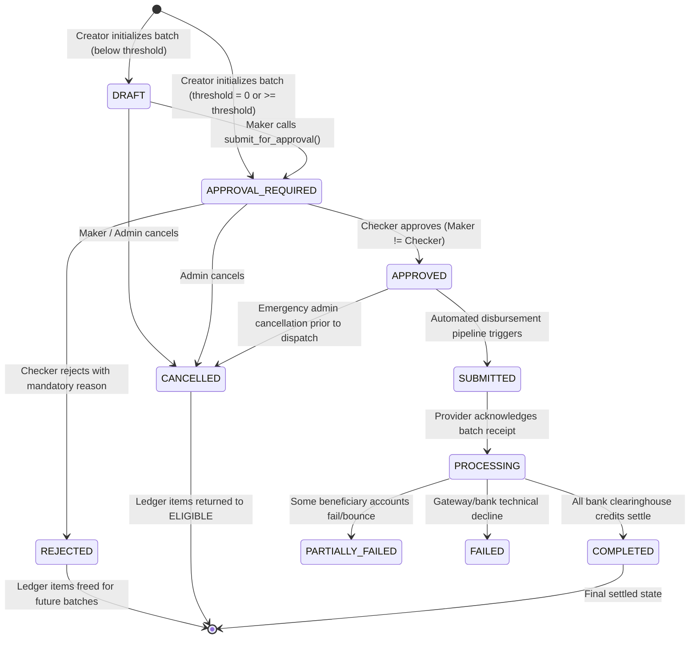

# Phase 8.9 — Settlement Maker-Checker Dual Control & Approval Workflows

## 1. Overview & Objective

In multi-tenant financial disbursements, dual control (Maker-Checker protocol) is a mandatory internal control standard. It ensures that no single individual has unilateral power to initiate and disburse platform funds to beneficiaries (mechanics).

Phase 8.9 introduces:
1. **Separation of Duties (SoD)**: The administrator who creates a settlement batch (**Maker**) is strictly prohibited from approving or executing that batch.
2. **Checker Authorization**: Only a distinct, authorized administrator or finance officer (**Checker**) can approve, reject, or mandate changes.
3. **Threshold-Driven Policies**: Dynamic policy routing (`settlement_approval_policies`) allowing automatic `approval_required` flags above configured financial limits or mandatory dual control on all batches.
4. **Financial Immutability**: Batches in `approved`, `submitted`, `processing`, or `completed` states are locked against financial mutations (no ledger additions, deletions, or amount modifications).
5. **Auditable Verification Trail**: Every action (`submitted_for_approval`, `approved`, `rejected`, `cancelled`) is permanently logged into `settlement_batch_approvals` and `audit_logs`.

---

## 2. Architecture & Database Design

### 2.1 Schema Extensions

#### `settlement_approval_policies`
Stores the active disbursement approval policy:
```sql
CREATE TABLE public.settlement_approval_policies (
    id UUID PRIMARY KEY DEFAULT gen_random_uuid(),
    threshold_amount NUMERIC(12, 2) NOT NULL DEFAULT 0.00,
    currency VARCHAR(3) NOT NULL DEFAULT 'INR',
    requires_checker BOOLEAN NOT NULL DEFAULT true,
    is_active BOOLEAN NOT NULL DEFAULT true,
    created_at TIMESTAMPTZ NOT NULL DEFAULT now(),
    updated_at TIMESTAMPTZ NOT NULL DEFAULT now()
);
```

#### `settlement_batch_approvals`
Maintains the immutable record of all dual-control decisions:
```sql
CREATE TABLE public.settlement_batch_approvals (
    id UUID PRIMARY KEY DEFAULT gen_random_uuid(),
    settlement_batch_id UUID NOT NULL REFERENCES public.settlement_batches(id) ON DELETE RESTRICT,
    action VARCHAR(50) NOT NULL CHECK (action IN ('submitted_for_approval', 'approved', 'rejected', 'cancelled')),
    actor_id UUID NOT NULL,
    actor_role VARCHAR(50) NOT NULL,
    reason TEXT,
    created_at TIMESTAMPTZ NOT NULL DEFAULT now()
);
```

#### Extended Columns on `settlement_batches`
- `submitted_by`: UUID of the Maker submitting the batch for review.
- `submitted_at`: Timestamp of submission.
- `approved_by`: UUID of the Checker approving the batch.
- `approved_at`: Timestamp of Checker sign-off.
- `cancelled_by`: UUID of the actor cancelling the batch.
- `cancelled_at`: Timestamp of batch cancellation.
- `rejection_reason`: Mandatory reason when a Checker rejects a batch.

---

## 3. Maker-Checker State Machine



### 3.1 Strict Transition Matrix & Validation Rules

| Current Status | Allowed Target Status | Authorized Role | Restrictions & Validations |
| :--- | :--- | :--- | :--- |
| `draft` | `approval_required` | Maker / Admin | Validates total items > 0 and amount integrity. |
| `draft` | `cancelled` | Maker / Admin | Releases ledger items back to `eligible`. |
| `approval_required` | `approved` | **Checker Only** | **`actor_id != batch.created_by`** strictly enforced. |
| `approval_required` | `rejected` | **Checker Only** | Mandatory non-empty reason required; unlocks ledger. |
| `approval_required` | `cancelled` | Admin | Releases ledger items back to `eligible`. |
| `approved` | `submitted` | System / Worker | Batches cannot be submitted to provider without `approved`. |
| `approved` | `cancelled` | Super Admin | Pre-transmission emergency stop only. |
| `submitted` | `processing` | Webhook / System | Bank acknowledgement. Financial mutation locked. |
| `processing` | `completed` | Webhook / System | All line items cleared. Terminal state. |

---

## 4. Maker-Checker Security Enforcement

### 4.1 Server-Side Invariant (Backend)
```python
# Maker-Checker Independence Rule
if batch.created_by and str(batch.created_by) == str(actor_id):
    raise HTTPException(
        status_code=status.HTTP_403_FORBIDDEN,
        detail="Maker-Checker violation: Batch creator cannot approve or reject their own batch",
    )
```

### 4.2 Financial Mutation Lock
Attempts to append or remove ledger records, or modify batch amounts once a batch has reached `approved`, `submitted`, `processing`, or `completed` raise an immediate `400 Bad Request`:
```python
def validate_financial_mutation(batch_status: str):
    if batch_status in ("approved", "submitted", "processing", "completed"):
        raise HTTPException(
            status_code=status.HTTP_400_BAD_REQUEST,
            detail=f"Financial mutation prohibited: Batch is in '{batch_status}' state and locked",
        )
```

### 4.3 Frontend Visual Guardrails
- **Self-Approval Warning**: If the logged-in administrator is the Maker of an `approval_required` batch, the "Approve" and "Reject" buttons are hidden and replaced with an informative badge:
  `[Self-Approval Restricted — Pending Independent Review]`.
- **Checker Actions**: Only distinct administrators see the interactive "Approve" and "Reject" action triggers.

---

## 5. Audit Logging & Compliance

Every approval-related operation automatically writes to both `settlement_batch_approvals` and the centralized `audit_logs` table:
- **`entity_type`**: `settlement_batch`
- **`action`**: `BATCH_APPROVED`, `BATCH_REJECTED`, `BATCH_SUBMITTED_FOR_REVIEW`, `BATCH_CANCELLED`
- **`actor_id`**: Active Supabase Auth UUID
- **`metadata`**: Includes `batch_number`, `total_amount`, `currency`, `item_count`, and `reason`.

Audit log entries are immutable and protected by Postgres Row-Level Security (`FOR INSERT ONLY` for service role, read-only for system administrators).
